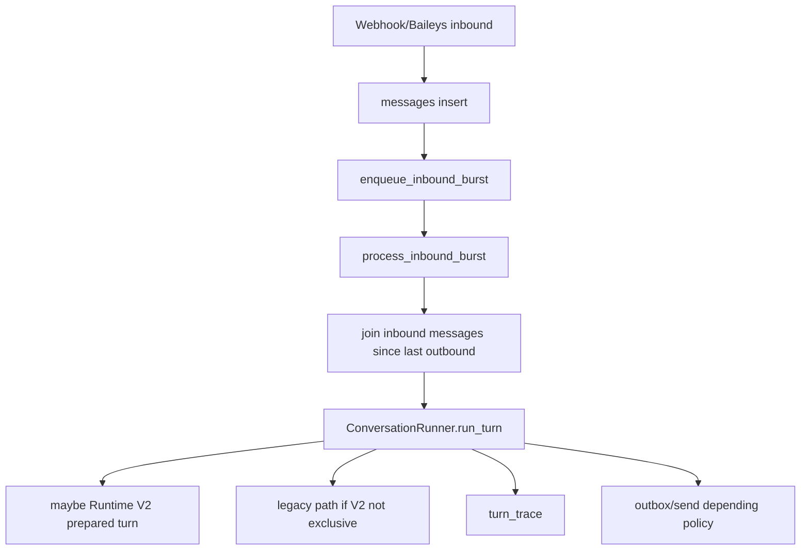
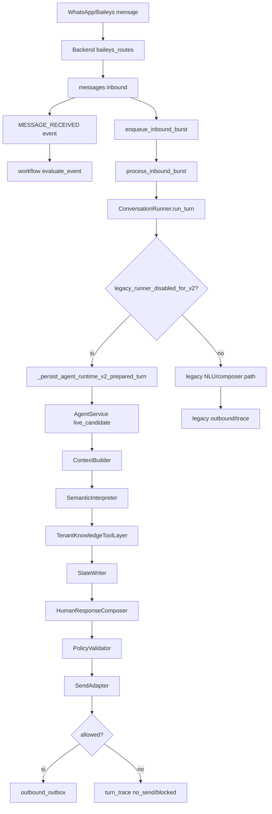
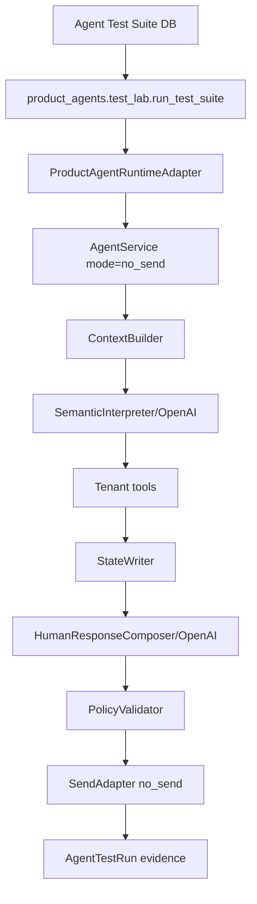

# Auditoria Completa AtendIA - 2026-06-09

## 0. Alcance y lectura honesta

Esta auditoria revisa el programa AtendIA desde el workspace actual en:

`C:\Users\Sprt\Documents\Proyectos IA\AtendIA-v2`

El objetivo fue responder:

- Que features existen realmente.
- Que features sirven hoy.
- Que features existen pero no estan completamente conectadas.
- Que features estan rotas, riesgosas o son legacy.
- Como se conecta el flujo desde Input Processing hasta Output.
- Donde esta cada pieza en el codigo.
- Que riesgos quedan antes de volver a live/smoke.

No se ejecuto WhatsApp, smoke, outbox live, workflows reales, canary, produccion abierta, migraciones, Docker mutante ni comandos destructivos. Esta es una auditoria de codigo/documentos/estructura, no una activacion operativa.

## 1. Veredicto ejecutivo

AtendIA tiene una plataforma grande y con muchas piezas reales:

- Backend FastAPI multi-tenant.
- Inbox/conversaciones/clientes/campos/contact memory.
- Meta webhook y Baileys bridge.
- Persistencia de mensajes y conversaciones.
- Workflows/eventos/audit log/realtime.
- Outbox.
- Knowledge OS.
- Runtime V2 con `AgentService`.
- Semantic Interpreter con JSON schema.
- Tool layer tenant-aware para catalogo, requisitos, FAQ, cotizacion, documentos y expediente.
- StateWriter con validacion.
- HumanResponseComposer con OpenAI y policy.
- Universal turn trace.
- Product-First Agent Builder.
- Product agent entities.
- Tool/action bindings productizados.
- Test Lab DB-backed no-send.
- Publish Control no-send.
- Frontend para Agent Builder.
- Tests unitarios/integracion extensos por area.

Pero el sistema todavia no esta limpio de punta a punta en live real:

- El inbound real por WhatsApp/Baileys todavia entra por `ConversationRunner`.
- `ConversationRunner` puede desviar a Runtime V2 si `legacy_runner_disabled_for_v2` esta activo, pero sigue siendo el puente operativo real.
- El Runtime V2 existe y ha pasado no-send/replay, pero live ha mostrado respuestas malas, silencios y fugas de logica interna en incidentes recientes.
- El composer actual mejoro, pero todavia esta basado en `ValidatedResponsePlan` con `pending_slot`, `next_best_question` y reparaciones deterministas; no existe aun un `ConversationFirstComposer` puro.
- Product-First existe como base fuerte, pero gran parte esta en archivos sin trackear en git, por lo que el baseline no esta consolidado.
- Hay muchos reportes/docs marcados como borrados en git, lo que vuelve riesgoso seguir metiendo cambios sin checkpoint.

Conclusion corta:

AtendIA ya tiene piezas reales de plataforma product-first, pero el live conversacional todavia no debe considerarse confiable ni product-first limpio. El sistema sirve muy bien para no-send/Test Lab/auditoria/control plane, pero el camino WhatsApp live necesita aislar legacy, cerrar composer conversacional y confirmar send path antes de otro intento serio.

Decision recomendada de estado:

`PROGRAM_AUDIT_READY_WITH_LIVE_RISKS`

No recomiendo produccion abierta.

## 2. Estado del worktree

El worktree esta muy sucio.

Hallazgos:

- Muchos archivos nuevos aparecen como `??`, incluyendo:
  - `Arquitectura-Deseada.md`
  - `ARCHITECTURE.md`
  - `.specify/`
  - `specs/`
  - `core/atendia/agent_runtime/agent_service.py`
  - `core/atendia/agent_runtime/semantic_interpreter.py`
  - `core/atendia/agent_runtime/human_response_composer.py`
  - `core/atendia/agent_runtime/knowledge_tool_layer.py`
  - `core/atendia/agent_runtime/send_adapter.py`
  - `core/atendia/db/models/product_agent.py`
  - `core/atendia/product_agents/`
  - `core/tests/product_agents/`
  - `frontend/src/features/product-agent-builder/`
  - muchos reportes nuevos en `reports/`.
- Muchos archivos historicos aparecen como `D`, incluyendo reportes, docs antiguas, QA, scripts y fuentes legacy.
- Hay archivos modificados en runtime, runner, tests, frontend y main API.

Implicacion:

- Muchas features "existen" en el workspace, pero no necesariamente estan consolidadas en git.
- No conviene borrar, resetear ni limpiar sin un checkpoint acordado.
- Para cualquier entrega seria falta decidir si se va a preservar todo, commitear por fases, o separar cambios.

## 3. Autoridad documental real

Documentos actuales clave:

- `AGENTS.md`: regla operativa para Codex.
- `ARCHITECTURE.md`: resumen estable.
- `Arquitectura-Deseada.md`: fuente canonica Product-First.
- `.specify/memory/constitution.md`: constitucion spec-kit.
- `specs/001-product-first-agent-platform/`: spec, plan, tasks.
- `docs/architecture/`: contratos vigentes.
- `docs/product/`: specs de producto.
- `reports/`: evidencia historica/incidentes/simulaciones.

Regla actual correcta:

Si `reports/` contradice `Arquitectura-Deseada.md`, gana `Arquitectura-Deseada.md` para implementacion futura.

Esto esta bien definido y sirve.

Riesgo:

Hay demasiados reportes antiguos borrados en git y muchos reportes nuevos sin trackear. Eso hace dificil distinguir evidencia vigente de evidencia historica sin un indice o checkpoint.

## 4. Mapa general del sistema

AtendIA esta partido en estas areas:

| Area | Existe | Sirve hoy | Estado |
|---|---:|---:|---|
| Backend FastAPI | Si | Si | Conectado |
| Frontend React/TanStack | Si | Si | Conectado |
| Auth/tenants/users | Si | Si | Conectado |
| Inbox/conversations/messages | Si | Si | Conectado |
| Customers/contact fields | Si | Si | Conectado |
| Meta Cloud webhook | Si | Parcial | Conectado, menos usado que Baileys en smoke actual |
| Baileys bridge | Si | Si | Conectado, pero live reciente inestable |
| Workflows | Si | Si | Conectado, side effects deben quedar gated |
| Outbox | Si | Si | Conectado, peligroso si flags se abren mal |
| Runtime legacy `ConversationRunner` | Si | Si, pero riesgoso | Aislar/degradar |
| Runtime V2 `AgentService` | Si | Si en no-send; live limitado | En progreso |
| Semantic Interpreter ChatGPT | Si | Si | Mejorado con schema estricto |
| Tenant tools | Si | Si para Dinamo/Test Lab | Deben generalizar por contrato |
| StateWriter | Si | Si | Guardrail real, aun sensible a field policy |
| HumanResponseComposer | Si | Parcial | Aun slot-plan-first, no conversation-first puro |
| PolicyValidator | Si | Si | Bloquea copy generico/interno |
| Universal turn trace | Si | Si | Conectado |
| Product Agent entities | Si | Si | Base real, sin live |
| Agent Builder UI/API | Si | Si | MVP |
| Test Lab DB-backed | Si | Si | Fuerte en no-send |
| Publish Control | Si | Parcial | Solo no-send seguro |
| Open production/canary | Conceptos/docs | No | No listo |

## 5. Input Processing a Output: ruta real actual

### 5.1 Entrada por Meta Cloud API

Archivo principal:

`core/atendia/webhooks/meta_routes.py`

Ruta:

1. `POST /webhooks/meta/{tenant_id}` recibe webhook.
2. Valida firma con `MetaCloudAPIAdapter`.
3. Valida que `phone_number_id` pertenezca al tenant.
4. Parsea mensajes y status callbacks.
5. Resuelve URLs de attachments con Meta Graph API si aplica.
6. Inserta o actualiza customer por telefono.
7. Busca o crea conversacion.
8. Inserta mensaje inbound en `messages`.
9. Incrementa unread y activity.
10. Emite evento `MESSAGE_RECEIVED`.
11. Evalua workflows inline via `evaluate_event`.
12. Publica evento realtime.
13. Encola `process_inbound_burst`.

Estado:

- La ruta existe y esta conectada.
- La persistencia inbound existe.
- Los attachments se resuelven best-effort.
- Workflows se evaluan desde el webhook, lo cual sirve pero debe seguir gated para side effects.
- El runner real se difiere a cola, no se ejecuta inmediatamente en el webhook.

Riesgo:

- Si workflows no estan correctamente gated, pueden generar side effects antes del runtime conversacional.
- El input real termina en `inbound_burst`, que todavia usa `ConversationRunner` como entrypoint.

### 5.2 Entrada por Baileys

Archivos principales:

- `core/baileys-bridge/src/routes.js`
- `core/atendia/api/baileys_routes.py`

Baileys sidecar:

- `POST /sessions/:tid/connect`
- `GET /sessions/:tid/qr`
- `GET /sessions/:tid/status`
- `POST /sessions/:tid/disconnect`
- `POST /sessions/:tid/send`

Backend Baileys:

- Recibe inbound desde el bridge.
- Inserta mensaje.
- Emite evento.
- Evalua workflows.
- Publica realtime.
- Encola `enqueue_inbound_burst`.
- Puede ejecutar `_run_inbound_pipeline` con `ConversationRunner`.

Estado:

- Existe y esta conectado.
- Fue el canal usado en smokes recientes.
- Permite envio por puente Baileys.

Riesgo:

- Los incidentes live recientes fueron en esta zona operacional.
- Aunque V2 exista, la entrada real aun esta en el borde legacy/bridge.
- Si el runner falla, puede haber silencio.

### 5.3 Debounce/burst de inbound

Archivo:

`core/atendia/queue/inbound_burst.py`

Funcion:

- Agrupa mensajes rapidos de una conversacion.
- Espera `BURST_DEFER_SECONDS = 5`.
- Usa lock Redis por conversacion.
- Junta inbound desde el ultimo outbound.
- Construye `CanonicalMessage`.
- Calcula `turn_number`.
- Carga seleccion de proveedor AI tenant.
- Instancia `ConversationRunner`.
- Ejecuta `runner.run_turn`.
- Despues ejecuta Runtime V2 shadow observability.

Flujo:



Estado:

- Sirve para evitar responder a cada mensaje fragmentado.
- Tiene lock para no correr dos runners en la misma conversacion.

Riesgo:

- Es un punto donde legacy y V2 siguen acoplados.
- Si el marker/stale/lock falla, puede no responder.
- Si `last_outbound_at` o batch logic queda raro, puede juntar mensajes no esperados.
- Si `ConversationRunner` no se desactiva para V2, puede producir salida legacy.

### 5.4 ConversationRunner legacy

Archivo:

`core/atendia/runner/conversation_runner.py`

Funcion historica:

- Lee `conversation_state`.
- Evalua `bot_paused`.
- Carga tenant config.
- Decide si legacy esta deshabilitado para V2.
- Si legacy esta deshabilitado, llama `_persist_agent_runtime_v2_prepared_turn`.
- Si no, sigue flujo legacy: NLU, control, composer, workflows, outbox, followups, etc.

Punto clave:

```text
if _legacy_runner_disabled_for_v2(early_tenant_config):
    return await _persist_agent_runtime_v2_prepared_turn(...)
```

Estado:

- Existe y funciona como puente.
- Permite desviar a V2.
- Todavia es el entrypoint live operativo.

Riesgo:

- Legacy sigue muy cerca de la ruta visible.
- Aunque `legacy_visible_output_blocked` exista, el sistema depende de flags/config para que no se cuele.
- Esta es una fuente probable de comportamiento "robotico" o no product-first si el tenant no queda exactamente configurado.

### 5.5 Runtime V2 AgentService

Archivo:

`core/atendia/agent_runtime/agent_service.py`

Flujo real:

1. `ContextBuilder.build`.
2. `AdvisorFirstAgentProvider.generate`.
3. `PolicyValidator.validate_or_raise`.
4. Bloqueo si required tools no succeeded.
5. `persist_runtime_v2_turn_state`.
6. Carga `tenant.config.agent_runtime_v2`.
7. Evalua contact scope.
8. Evalua provider fallback.
9. `RuntimeV2SendAdapter.apply`.
10. Devuelve `AgentServiceResult`.

Estado:

- Esta es la mejor ruta nueva.
- Es DB-backed.
- Soporta `mode="no_send"` y `mode="live_candidate"`.
- No-send y live-candidate comparten contexto/tools/state/policy/composer; debe cambiar solo SendAdapter.

Riesgo:

- En live real todavia entra a traves de `ConversationRunner`.
- Si `output` queda `None`, se fail-close y puede haber silencio.
- Si required tool falta, se bloquea envio.

### 5.6 ContextBuilder

Archivo:

`core/atendia/agent_runtime/context_builder.py`

Carga:

- Ultimos mensajes de conversacion.
- Customer.
- Conversation state.
- Active agent.
- Contact fields visibles.
- Tenant runtime config.
- Tenant default voice.
- Knowledge citations si hay provider.
- Tenant domain contract.
- Product agent runtime overlay en no-send.

Estado:

- Conectado.
- Tiene limite de historial configurable, default 20.
- Conecta Product Agent runtime adapter con Runtime V2.

Riesgo:

- Si `visible_contact_field_keys` no incluye un campo requerido, StateWriter puede bloquear y el composer puede quedar sin base.
- Ya hubo incidente con `employment_seniority` bloqueado por field visibility.

### 5.7 Semantic Interpreter

Archivo:

`core/atendia/agent_runtime/semantic_interpreter.py`

Existe un contrato canonico:

- `intent`
- `user_act`
- `pending_slot_answered`
- `semantic_understanding`
- `income.present`
- `income.candidate`
- `income.evidence`
- `income.confidence`
- `income.needs_clarification`
- `proposed_fields`
- `missing_field`
- `required_tools`
- `response_plan`
- `final_message_draft`
- `confidence`
- `risk_flags`

Enums de ingreso:

- `nomina_tarjeta`
- `nomina_recibos`
- `pensionado`
- `negocio_sat`
- `sin_comprobantes`
- `guardia_seguridad`
- `unknown`

User act:

- `greeting`
- `answer_to_pending_slot`
- `question`
- `correction`
- `document_upload`
- `confirmation`
- `objection`
- `confusion`
- `frustration`
- `off_topic`
- `human_request`
- `unknown`

Estado:

- Esto es correcto arquitectonicamente.
- ChatGPT devuelve JSON schema, no señales libres.
- Reduce keyword routing.

Riesgo:

- La interpretacion estructurada todavia se transforma a `AdvisorBrainDecision`, y de ahi a plan/composer. Si esa traduccion mete sesgo de pending-slot, vuelve el problema.

### 5.8 TenantKnowledgeToolLayer

Archivo:

`core/atendia/agent_runtime/knowledge_tool_layer.py`

Tools conectadas:

- `catalog.search`
- `credit_plan.resolve`
- `requirements.lookup`
- `document.check`
- `expediente.evaluate`
- `faq.lookup`
- `quote.resolve`

Principio declarado:

`TenantKnowledgeToolLayer` ejecuta solo tools pedidas por la interpretacion semantica de ChatGPT.

Estado:

- Funciona para facts estructurados.
- Lee sources tenant-aware.
- Para Dinamo ya hubo correcciones de source paths dentro de Docker.
- Tiene herramientas fact-only que no deben redactar texto final.

Riesgo:

- Algunas funciones internas usan matching local sobre JSON tenant. Eso puede estar bien si es resolucion factual, pero debe mantenerse fuera de "interpretar conversacion".
- Si ChatGPT no pide la tool correcta, el runtime debe tener reglas de orquestacion por `pending_slot` y contrato, no por keyword.

### 5.9 StateWriter

Archivo:

`core/atendia/agent_runtime/state_writer.py`

Responsabilidad:

- Convertir propuestas validadas en `FieldUpdate`/`LifecycleUpdate`.
- Bloquear campos no declarados.
- Respetar safe mode.
- Exigir herramientas para product/quote/document fields.
- Escribir solo datos con evidencia.
- Invalidar cotizaciones cuando cambia producto/plan.

Estado:

- Es un guardrail real.
- Tiene decisiones `accepted`, `blocked`, `needs_review`.
- Se conecta a persistencia por `persist_runtime_v2_turn_state`.

Riesgo:

- Es sensible a field policy/visible fields.
- Ya produjo un incidente donde `employment_seniority` se bloqueo por `field_not_visible`.
- La razon interna no debe llegar nunca al usuario.

### 5.10 HumanResponseComposer

Archivo:

`core/atendia/agent_runtime/human_response_composer.py`

Funcion:

- Construye `ValidatedResponsePlan`.
- Llama OpenAI con JSON schema para obtener `final_message_candidate`.
- Valida la respuesta.
- Puede reparar preguntas de pending slot.
- Si falla, puede usar fallback seguro o fail-closed.

Protecciones:

- Bloquea frases genericas.
- Bloquea texto interno: JSON, trace, tool, prompt, workflow, outbox, `field_not_visible`, StateWriter.
- Bloquea precios sin quote.
- Bloquea requisitos sin requirements.
- Bloquea promesas de aprobacion.

Estado:

- Mejor que el composer viejo.
- Ya paso tests/no-send segun reportes.
- Bloquea varias frases horribles que ya aparecieron.

Problema real:

- Todavia no es plenamente "conversation-first".
- Depende de `ValidatedResponsePlanBuilder`.
- El plan contiene `pending_slot`, `slot_consumed`, `next_best_question`, `message_goal`.
- Hay reparacion determinista de preguntas.
- Esto puede volver a producir respuestas tipo formulario aunque ChatGPT interprete bien.

Conclusion:

Sirve como guardrail/composer intermedio, pero no resuelve por completo la calidad humana de live. Falta una capa tipo `ConversationFirstComposer` o una refactorizacion donde ChatGPT redacte desde hechos validados y acto conversacional, sin escalera de slots como autoridad principal.

### 5.11 PolicyValidator

Archivo:

`core/atendia/agent_runtime/policy_validator.py`

Bloquea:

- Multiples final messages.
- `final_message` vacio.
- Placeholders.
- Promesas de aprobacion.
- Copy generico.
- Texto interno.
- Precio sin quote facts.
- Requisitos sin requirements facts.
- Claim de slot consumido cuando no se consumio.
- Field update sin evidencia/confianza.
- Lifecycle sin razon/evidencia.
- Acciones no permitidas.

Estado:

- Sirve.
- Debe mantenerse como gate final antes de envio.

Riesgo:

- Si bloquea demasiado, puede provocar silencio si no hay respuesta segura aceptable.
- Debe registrar bloqueo y dar trazabilidad, no inventar copy.

### 5.12 SendAdapter

Archivo:

`core/atendia/agent_runtime/send_adapter.py`

Modo no-send:

- Fuerza `send_enabled=false`.
- No escribe outbox.
- Devuelve `send_status=no_send`.

Modo live-candidate:

- Evalua `evaluate_prepared_send_policy`.
- Si bloqueado, no escribe.
- Si permitido y hay `final_message`, llama `enqueue_messages`.
- Marca metadata `runtime_path=agent_runtime_v2`.

Estado:

- Bien separado.
- Es la frontera correcta.

Riesgo:

- Si flags/allowlist estan mal, puede escribir outbox.
- Si output es bloqueado por policy, no envia y el usuario puede ver silencio.

### 5.13 Outbox y salida

Archivos:

- `core/atendia/queue/outbox.py`
- `core/atendia/runner/outbound_dispatcher.py`
- `core/atendia/api/baileys_routes.py`
- `core/baileys-bridge/src/routes.js`

Responsabilidad:

- Persistir outbound en `outbound_outbox`.
- Worker/dispatcher envia al canal correspondiente.
- Baileys sidecar hace `sendText`.

Estado:

- Existe y funciona.
- DB audits recientes indican `pending/retry=0` en momentos especificos.

Riesgo:

- Live send depende de flags globales + tenant config + send scope + contact allowlist.
- Un error de policy puede impedir outbox y parecer "no responde".
- Un error de worker/bridge puede dejar outbox pendiente.

## 6. Ruta live actual: diagrama honesto



Lectura:

- La ruta V2 existe.
- Pero el entrypoint live real sigue siendo `ConversationRunner`.
- La arquitectura deseada pide un unico `AgentService` como owner; aun no esta plenamente logrado en live.

## 7. Ruta no-send/Test Lab actual



Estado:

- Esta es la ruta mas limpia y mas alineada con Product-First.
- Ejecuta DB-backed no-send.
- Registra turn results, trace ids, outbox audit y side effect audit.
- No prueba por si sola que WhatsApp live este listo, pero si prueba el cerebro y policy sin enviar.

## 8. Feature inventory del agente configurable

### 8.1 Agente IA configurable

Estado: `implemented / partially connected`

Existe:

- `agents` legacy/product config.
- `AgentVersion`.
- `AgentDeployment`.
- Agent Builder UI.
- Builder config API.
- Prompt/instructions/tone/language.
- Knowledge/tool/action/field/workflow policies.

Archivos:

- `core/atendia/db/models/agent.py`
- `core/atendia/db/models/product_agent.py`
- `core/atendia/product_agents/service.py`
- `core/atendia/api/product_agents_routes.py`
- `frontend/src/features/product-agent-builder/components/AgentBuilderPage.tsx`

Sirve:

- Se puede modelar un agente tenant-scoped.
- Se puede crear version/draft/publicacion no-send.
- Se puede evaluar readiness.

No completo:

- Agente publicado Product-First aun no gobierna totalmente el live WhatsApp.
- Runtime live todavia depende de tenant runtime config y puente `ConversationRunner`.

### 8.2 Conversacion natural con Knowledge Base

Estado: `no_send_passed / live risky`

Existe:

- Knowledge OS.
- Retrieval/citations.
- Tenant tools.
- Semantic interpreter.
- Composer humano.

Sirve:

- En Test Lab/no-send puede usar knowledge y tools.
- Puede responder FAQ/catalogo/requisitos/cotizacion si tools pasan.

No completo:

- Live reciente mostro copy repetitiva, silencio y mensajes mediocres.
- Falta ConversationFirstComposer o equivalente.

### 8.3 Uso de fuentes de conocimiento

Estado: `connected`

Existe:

- `knowledge_sources`.
- Product knowledge bindings.
- Tenant sources Dinamo.
- `TenantKnowledgeToolLayer`.

Sirve:

- `catalog.search`, `requirements.lookup`, `faq.lookup`, `quote.resolve`, `document.check`, `expediente.evaluate`.
- Readiness bloquea fuentes no saludables.

No completo:

- Ingestion/index general puede variar por tipo de fuente.
- Dinamo tiene contrato muy especifico; debe mantenerse como tenant source, no core.

### 8.4 Instrucciones y prompts personalizados

Estado: `implemented`

Existe:

- `AgentVersion.instructions`.
- `prompt_blocks`.
- `tone`, `language`, `role`.
- `agent_studio_config_from_values`.

Sirve:

- Builder puede configurar base del agente.

No completo:

- La redaccion final todavia puede ser dominada por plan/slot.
- Hace falta garantizar que instrucciones no se vuelvan prompt gigante incontrolado.

### 8.5 Seguimiento de flujo conversacional

Estado: `partial`

Existe:

- `pending_slot`.
- `question_slot`.
- lifecycle/current_stage.
- flow policy tenant.
- ValidatedResponsePlan.

Sirve:

- Puede pedir datos faltantes.
- Puede guardar antiguedad, ingreso, modelo, requisitos segun tools.

No completo:

- El flujo todavia puede sonar secuencial/formulario.
- Pending slot ha dominado saludos o confusion en incidentes.
- Falta clasificacion conversacional como autoridad previa al consumo de slot.

### 8.6 Extraccion automatica de datos del cliente

Estado: `connected / guarded`

Existe:

- Semantic proposed fields.
- StateWriter.
- Contact fields.
- runtime state persistence.

Sirve:

- Guarda campos validados con evidencia.
- Bloquea campos no visibles/no declarados.

No completo:

- Si field policy falta, puede bloquear datos correctos.
- Hay que mejorar UX de bloqueo para no dejar silencio ni copy interno.

### 8.7 Actualizacion de campos de contacto

Estado: `connected`

Existe:

- `customer_field_definitions`.
- `customer_field_values`.
- `FieldUpdate`.
- `persist_runtime_v2_turn_state`.
- `AgentFieldPermission`.

Sirve:

- Se pueden escribir campos desde runtime con evidencia.

No completo:

- Product Agent field permissions aun no estan dominando todo live.

### 8.8 Gestion de etapas del ciclo de vida

Estado: `partial`

Existe:

- `conversations.current_stage`.
- `conversation_state`.
- lifecycle schemas/history.
- pipeline routes.
- workflow events.

Sirve:

- Puede mover estados y registrar lifecycle updates.

No completo:

- No esta claro que Agent Builder ya controle lifecycle stages publicados de forma completa.
- En live puede depender de legacy/pipeline.

### 8.9 Activacion de Workflows internos

Estado: `connected / dangerous if ungated`

Existe:

- `workflows.engine.evaluate_event`.
- workflow execution queue.
- workflow bindings productizados.
- side effect flags.

Sirve:

- Eventos inbound pueden disparar workflows.
- Product workflow binding model existe.

No completo:

- Workflows no deben tocar customer visible copy.
- Side effects live deben seguir apagados salvo aprobacion literal.

### 8.10 Solicitudes HTTP e integraciones externas

Estado: `partial`

Existe:

- Integrations routes.
- `call_webhook` action capability.
- Action registry/product bindings.

Sirve:

- La plataforma tiene estructura para integraciones.

No completo:

- No hay evidencia de action live externa lista.
- En Product-First, actions estan `approval_required`/dry-run, no live.

### 8.11 Handoff a humano

Estado: `connected`

Existe:

- Handoffs routes.
- Conversation control.
- `needs_human`.
- Policy fallback/human review.

Sirve:

- Puede pausar bot o marcar revision humana.

No completo:

- Copy de handoff debe evitar sonar generica.
- En incidentes salio "tu solicitud esta siendo revisada", ahora bloqueada por policy.

### 8.12 Filtrado y calificacion de clientes

Estado: `partial`

Existe:

- Customer scores, risks, next best actions.
- Semantic intent.
- Field extraction.
- Requirements/qualification for Dinamo.

Sirve:

- Puede calificar con datos capturados.

No completo:

- No hay evidencia de calificacion product-first generica completa por tenant.

### 8.13 Soporte multimodal

Estado: `partial`

Existe:

- Attachments en webhooks.
- Media URL resolver en Meta.
- Baileys attachments handling.
- `document.check`.
- Customer documents.

Sirve:

- Puede recibir/clasificar documentos basicos.

No completo:

- Vision real/document OCR general no queda probado como producto completo.
- Notas de voz/audio no aparecen como feature madura.

### 8.14 Seguimiento automatico de prospectos

Estado: `implemented legacy / needs productization`

Existe:

- Followup scheduler.
- Conversation state followups.
- Workflows.

Sirve:

- Legacy puede programar/cancelar followups.

No completo:

- Product-First followups deben configurarse desde Agent Builder/Workflows y ser publish-gated.

### 8.15 Manejo multilingue

Estado: `partial`

Existe:

- `language` y `language_policy` en agent config.
- Composer schema incluye `language`.

Sirve:

- Puede orientar idioma.

No completo:

- No hay evidencia de suite multilingue fuerte.

### 8.16 Asignacion a equipos o asesores

Estado: `partial`

Existe:

- `assigned_user_id`.
- Handoffs.
- Workflows.
- Users/roles.

Sirve:

- Puede asignar conversaciones/handoff.

No completo:

- Agent Builder no parece tener asignacion a equipos como capability productizada completa.

### 8.17 Etiquetado automatico

Estado: `partial`

Existe:

- `customers.tags`.
- `conversations.tags`.
- Workflows/actions pueden actualizar estado.

Sirve:

- DB soporta tags.

No completo:

- No vi una action productizada especifica `apply_tag`.

### 8.18 No salirse del personaje

Estado: `partial`

Existe:

- Role/tone/voice/language.
- HumanResponseComposer system prompt.
- Policy.

Sirve:

- Puede mantener estilo por configuracion.

No completo:

- Las respuestas live recientes mostraron tono generico/robotico.
- Falta quality gate conversacional mas fuerte.

### 8.19 No inventar informacion

Estado: `connected`

Existe:

- Required tools.
- Quote/requisitos policy.
- PolicyValidator.
- StateWriter.
- Knowledge citations.

Sirve:

- Bloquea precios sin quote y requisitos sin requirements.
- Bloquea tool required missing.

No completo:

- Si se bloquea sin respuesta util, puede parecer que no responde.

### 8.20 Respuestas no roboticas

Estado: `blocked / partial`

Existe:

- HumanResponseComposer.
- Forbidden phrases.
- PolicyValidator generic copy blocks.
- Reportes de no-send passed.

Sirve:

- Reduce frases peores.

No completo:

- Live reciente todavia mostro:
  - pregunta de ingreso ante `hola`;
  - pregunta secuencial;
  - respuesta interna;
  - handoff generico;
  - silencio.
- Falta resolver `ConversationFirstComposer` o equivalente.

### 8.21 Control de limites y seguridad

Estado: `connected`

Existe:

- PolicyValidator.
- SendPolicy.
- SendAdapter.
- Field policy.
- Action registry.
- Publish Control.
- Test Lab.

Sirve:

- Fail-closed.
- No-send.
- Approved contact scope.
- Side effects gating.

No completo:

- El fail-closed puede convertirse en silencio si no hay una experiencia humana de bloqueo.

### 8.22 Automatizacion sin reconstruir procesos existentes

Estado: `partial`

Existe:

- Workflows legacy.
- Workflow bindings product-first.

Sirve:

- Puede enganchar eventos existentes.

No completo:

- Falta migration completa de workflows legacy a Product-First bindings.

### 8.23 Acciones configurables

Estado: `implemented control plane / not live`

Existe:

- `AgentActionBinding`.
- `ProductCapability`.
- `update_contact_field`.
- `trigger_workflow`.
- `call_webhook`.
- `send_message`.

Sirve:

- Builder/API puede registrar y validar actions.

No completo:

- Actions reales live siguen apagadas y deben seguir asi.

### 8.24 Manejo de archivos adjuntos mediante Workflow

Estado: `partial`

Existe:

- Attachments.
- Customer documents.
- `document.check`.
- `expediente.evaluate`.
- Workflow events.

Sirve:

- Clasificacion documental no-send para Dinamo ha sido probada.

No completo:

- Workflow documental end-to-end live no debe considerarse listo.

### 8.25 Trazabilidad de decisiones

Estado: `connected`

Existe:

- `turn_traces`.
- `universal_turn_trace`.
- `trace_metadata`.
- Agent Test Run trace IDs.
- Reports.
- Audit log.

Sirve:

- Permite ver tools, state writes, policy, send decision.

No completo:

- UX de trace/inbox puede mejorar.
- Debe ser obligatorio para cualquier live.

## 9. Product-First: que esta realmente implementado

### 9.1 Product entities

Archivos:

- `core/atendia/db/models/product_agent.py`
- `core/atendia/db/migrations/versions/066_product_first_agent_entities.py`
- `core/atendia/db/migrations/versions/067_product_first_agent_test_runs.py`
- `core/atendia/db/migrations/versions/068_product_first_publish_control.py`

Entidades:

- `AgentVersion`
- `AgentDeployment`
- `AgentKnowledgeSourceBinding`
- `AgentToolBinding`
- `AgentActionBinding`
- `AgentFieldPermission`
- `AgentWorkflowBinding`
- `AgentTestSuite`
- `AgentTestScenario`
- `AgentTestRun`
- `AgentPublishRequest`
- `AgentPublishEvent`

Estado:

- Base real.
- Tenant-scoped.
- Versionada.
- Publicacion no-send.
- Rollback target.
- Inmutable al publicar.

Riesgo:

- Archivos aparecen sin trackear en git.

### 9.2 Agent Builder

Archivos:

- `core/atendia/api/product_agents_routes.py`
- `core/atendia/product_agents/service.py`
- `frontend/src/features/product-agent-builder/api.ts`
- `frontend/src/features/product-agent-builder/components/AgentBuilderPage.tsx`
- `frontend/src/routes/(auth)/agent-builder.tsx`

Funcionalidades:

- List/create/update agents.
- Builder options.
- Knowledge source options.
- Tool/action options.
- Bind/unbind knowledge.
- Bind/unbind tools.
- Bind/unbind actions.
- Readiness.
- Draft versions.
- Builder config.
- Test suites/scenarios/runs.
- Deployments.
- Publish requests no-send.

Estado:

- MVP real.
- Con frontend y tests.

No completo:

- No es aun constructor completo estilo respond.io.
- No gobierna live end-to-end.

### 9.3 Tool/Action bindings

Archivo:

`core/atendia/product_agents/capability_registry.py`

Separacion correcta:

Tools/facts:

- `catalog.search`
- `quote.resolve`
- `requirements.lookup`
- `document.check`

Actions/side effects:

- `update_contact_field`
- `trigger_workflow`
- `call_webhook`
- `send_message`

Estado:

- Correcto como modelo.
- `send_message` esta disabled como boundary.

No completo:

- Falta ejecucion live segura para actions.

### 9.4 Test Lab

Archivo:

`core/atendia/product_agents/test_lab.py`

Modos:

- `simulated_contract`
- `openai_direct_provider`
- `runtime_v2_agent_service`

Limites reales:

- Max 2 escenarios.
- Max 6 turns por escenario, salvo replay especial.
- `mode=no_send` obligatorio para modos model-backed.
- Audita outbox y side effects.

Estado:

- Fuerte.
- Es la mejor herramienta actual para validar sin WhatsApp.

No completo:

- No reemplaza pruebas de canal real.

### 9.5 Publish Control

Estados permitidos:

- `draft`
- `test_required`
- `test_passed`
- `ready_for_approval`
- `published_no_send`
- `paused`
- `rollback_required`
- `rolled_back`
- `archived`

Bloquea:

- `published_live_limited`
- `single_contact_smoke`
- `canary`
- `production`
- `open_production`

Estado:

- Correcto para MVP seguro.
- Solo publica no-send.

No completo:

- Aun no administra live real como producto.

## 10. Legacy y riesgos activos

### 10.1 Legacy que aun existe

- `core/atendia/runner/conversation_runner.py`
- `core/atendia/runner/composer_openai.py`
- `core/atendia/runner/composer_prompts.py`
- `core/atendia/runner/response_contract.py`
- `core/atendia/runner/response_frame.py`
- `core/atendia/runner/dinamo_agent_runtime.py`
- `core/atendia/runner/advisor_brain.py`
- `core/atendia/runner/sales_advisor_decision_policy.py`
- `core/atendia/runner/turn_resolver.py`

Estado:

- Algunas piezas estan marcadas como fallback/legacy.
- Pero `ConversationRunner` todavia es entrada operativa real para inbound.

Riesgo:

- Cualquier tenant mal configurado puede caer a legacy.
- Legacy puede producir copy visible si no esta deshabilitado.
- Legacy mezcla control, composer, workflows y envio.

### 10.2 Runtime V2 fallback/composer fallback

En `advisor_pipeline.py` todavia existen fallbacks:

- `safe_advisor_brain`
- `_safe_composer_fallback`
- deterministic quote snippet.
- deterministic requirements template.
- deterministic handoff template.
- safe no price.

Estado:

- Sirven como safety.

Riesgo:

- Fallback visible puede sonar robotico o generico.
- En Runtime V2 published/live deberian ser no-send o human-review seguro, no copy al cliente.

### 10.3 Copy quality

Bloqueos actuales:

- `PolicyValidator.GENERIC_PROGRESS_COPY`
- `HumanResponseComposer.DEFAULT_FORBIDDEN_PHRASES`
- Replay gate forbidden copy.

Estado:

- Bloquea frases peores.

Riesgo:

- Bloquear frases no basta. La arquitectura debe generar mejor conversacion, no solo censurar malas frases.

## 11. Incidentes recientes segun reportes

Reportes relevantes:

- `reports/controlled_single_contact_smoke_v2_incident_2026_06_08.md`
- `reports/controlled_single_contact_smoke_v3_incident_2026_06_08.md`
- `reports/controlled_single_contact_smoke_v3_retry_activation_2026_06_09.md`
- `reports/live_transcript_replay_gate_2026_06_09.md`
- `reports/human_response_composer_from_validated_facts_2026_06_08.md`

Problemas observados en live por conversacion del usuario:

- Respuesta repetida tipo "Sí se puede revisar; para darte el plan correcto dime cómo recibes tus ingresos."
- Saludo tratado como avance de flujo.
- Pending slot dominando el acto conversacional.
- Antiguedad laboral bloqueada por field visibility.
- Texto interno expuesto: "no puedo registrar... campo no esta visible".
- Silencios despues de ciertos turnos.
- Handoff generico o copy mediocre.

Fixes reportados:

- Schema canonico en SemanticInterpreter.
- User act / turn type.
- Flow policy para antiguedad antes de ingreso en Dinamo.
- Source loading dentro de Docker.
- Bloqueo de internal text.
- Replay gate no-send passed.

Lectura honesta:

- La semantica y tools mejoraron.
- La calidad live aun no esta suficientemente cerrada.
- El problema no es solo "bug puntual"; es frontera live + composer + legacy isolation.

## 12. Tests y evidencia existente

Areas de tests detectadas:

- `core/tests/product_agents/`
- `core/tests/agent_runtime/`
- `core/tests/knowledge_os/`
- `core/tests/workflows/`
- `core/tests/queue/`
- `core/tests/api/`
- `frontend/tests/features/product-agent-builder/`

Tests product_agents visibles:

- `test_agent_model_tenant_scoped.py`
- `test_agent_version_immutable_after_publish.py`
- `test_agent_deployment_publish_state_machine.py`
- `test_knowledge_source_binding_requires_existing_source.py`
- `test_tool_binding_schema_validation.py`
- `test_action_binding_permissions.py`
- `test_publish_state_does_not_enable_live_send.py`
- `test_agent_entities_no_dinamo_hardcode.py`
- `test_agent_builder_api_routes.py`
- `test_publish_control_service.py`
- `test_agent_test_lab_runner.py`

Tests agent_runtime visibles:

- `test_semantic_interpreter_runtime_v2.py`
- `test_human_response_composer.py`
- `test_validated_response_plan_builder.py`
- `test_policy_validator.py`
- `test_context_builder_live_no_send_parity.py`
- `test_send_adapter_is_only_difference_between_no_send_and_live.py`
- `test_live_transcript_replay_gate.py`
- `test_runtime_v2_container_sources.py`
- `test_dinamo_income_resolution_policy.py`
- `test_state_writer_persists_between_turns_db_backed.py`
- `test_runtime_state_persistence.py`
- `test_tool_registry_parity_no_send_live.py`

Reportes recientes dicen:

- Product-first phases ready.
- Test Lab real no-send ready.
- HumanResponseComposer no-send passed.
- Live transcript replay gate passed.
- Outbox pending/retry 0 en auditorias concretas.
- Side effects 0 en auditorias concretas.

Limitacion:

- En esta auditoria no se corrio pytest completo.
- La evidencia de tests viene de estructura de repo y reportes existentes.
- Los smokes live reales posteriores mostraron problemas, asi que tests no-send no prueban canal live completo.

## 13. Que sirve hoy de verdad

Sirve para operar/controlar:

- Backend FastAPI.
- Frontend principal.
- Login/auth/tenant routes.
- Inbox y conversaciones.
- Clientes/campos.
- Webhooks Meta/Baileys para persistir inbound.
- Realtime notifications.
- Workflows como infraestructura.
- Outbox como infraestructura.
- Knowledge OS como infraestructura.
- Trace/audit como infraestructura.

Sirve para Product-First no-send:

- Agent entities.
- Agent Builder MVP.
- Knowledge source bindings.
- Tool/action bindings.
- Test Lab DB-backed.
- Publish Control no-send.
- Runtime V2 no-send.
- Semantic Interpreter.
- Tenant tools.
- StateWriter.
- PolicyValidator.
- SendAdapter no-send.

Sirve con cautela:

- Live single-contact smoke.
- Runtime V2 live-candidate.
- Baileys live send.

No recomiendo usar todavia:

- Produccion abierta.
- Canary.
- Actions live.
- Workflow side effects live.
- Open production.
- Legacy composer visible para Runtime V2.

## 14. Que no sirve o no esta completo

### 14.1 ConversationFirstComposer

No encontre un `ConversationFirstComposer` como pieza consolidada.

Existe:

- `HumanResponseComposer`
- `ValidatedResponsePlanBuilder`

Pero falta:

- Composer cuyo input principal sea acto conversacional + hechos validados + objetivo humano, no escalera de slots.

### 14.2 Live Product-First single route

No esta completo porque:

- Inbound live entra por `ConversationRunner`.
- Runtime V2 se engancha como prepared turn dentro del runner.
- Product Agent deployment no gobierna aun todo el live.

### 14.3 Copy conversacional humana

Parcial.

Se bloquearon frases malas, pero eso no garantiza buen texto.

Falta:

- Quality policy conversacional.
- Test Lab con criterios de naturalidad.
- Replay de transcript live con evaluacion humana.
- Mejor response planner.

### 14.4 Actions live

No listo.

Existen bindings y registry, pero por diseno deben seguir:

- disabled
- dry_run_only
- approval_required

### 14.5 Workflows Product-First live

Parcial.

Existen bindings y engine, pero falta que todos los workflows live pasen por Product-First publish/policy.

### 14.6 Multimodal completo

Parcial.

Documentos/attachments existen; audio/vision completa no se ve como producto maduro.

### 14.7 Produccion abierta

No existe como estado seguro.

Debe seguir bloqueada.

## 15. Conexiones por capa

### Backend API

`core/atendia/main.py` registra:

- Auth.
- Conversations.
- Customers.
- Documents.
- Fields.
- Knowledge.
- Product config.
- Product agents.
- Agent runtime V2.
- Workflows.
- Turn traces.
- Baileys.
- Meta webhooks.
- Websocket realtime.

Estado:

- Muy conectado.
- Plataforma no es dummy.

### Runtime

Conecta:

- `AgentService`
- `ContextBuilder`
- `AdvisorFirstAgentProvider`
- `SemanticAdvisorBrain`
- `TenantKnowledgeToolLayer`
- `DeterministicStateWriter`
- `HumanResponseComposer`
- `PolicyValidator`
- `RuntimeV2SendAdapter`

Estado:

- Arquitectura V2 existe.

### Product control plane

Conecta:

- `product_agents_routes`
- `product_agents.service`
- `product_agents.test_lab`
- `product_agents.runtime_adapter`
- DB product agent models.
- Frontend Agent Builder.

Estado:

- Existe como MVP real.

### Output

Conecta:

- `TurnOutput.final_message`
- `PolicyValidator`
- `SendAdapter`
- `enqueue_messages`
- `outbound_outbox`
- Baileys sidecar send.

Estado:

- La frontera existe.

Riesgo:

- Debe asegurarse que ningun workflow/fallback/legacy escriba copy visible.

## 16. Riesgos principales priorizados

### P0 - Live todavia no es confiable

Evidencia:

- Smokes reales recientes dieron respuestas malas y silencios.
- Live usa entrada por `ConversationRunner`.

Impacto:

- Cliente real puede recibir copy mediocre o quedarse sin respuesta.

Accion:

- No produccion abierta.
- No smoke sin replay de transcript exacto y rollback.

### P0 - Worktree sin baseline

Evidencia:

- Muchisimos `D`, `M` y `??`.

Impacto:

- Dificil saber que cambio introdujo que bug.
- Riesgo de perder evidencia.

Accion:

- Hacer checkpoint documental/git controlado antes de seguir.

### P1 - Composer aun slot-first

Evidencia:

- `ValidatedResponsePlanBuilder` produce `pending_slot`, `next_best_question`.
- `HumanResponseComposer` repara pregunta de slot.

Impacto:

- Respuestas tipo formulario.

Accion:

- Implementar ConversationFirstComposer / Response Intent Planner real.

### P1 - Legacy interference

Evidencia:

- `inbound_burst` instancia `ConversationRunner`.
- Runtime V2 preparado se llama desde runner.

Impacto:

- Puede caer a legacy si config falla.

Accion:

- Mover live V2 a AgentService entrypoint directo o bloquear hard legacy visible.

### P1 - Fail-closed puede parecer silencio

Evidencia:

- Required tool failure/policy failure bloquean send.

Impacto:

- Usuario dice "no responde".

Accion:

- Hacer que fail-closed sea observable internamente y que live solo este activo si no se espera bloqueo.

### P2 - Product-First no gobierna live aun

Evidencia:

- Publish Control solo permite `published_no_send`.
- ProductAgentRuntimeAdapter es para Test Lab no-send.

Impacto:

- Builder no es aun fuente unica de live.

Accion:

- Fase siguiente: deployment resolver product-first para live-candidate, sin activar envio.

## 17. Recomendacion de siguiente trabajo

Orden recomendado:

1. Crear checkpoint real del worktree sin limpiar.
2. Congelar live salvo aprobacion literal.
3. Implementar/refactorizar `ConversationFirstComposer` o equivalente:
   - input: user_act, latest messages, validated facts, pending state, style.
   - output: response intent + final candidate.
   - no escalera de slot como autoridad textual.
4. Aislar `ConversationRunner` de Runtime V2 live:
   - Runtime V2 debe ser entrypoint principal para tenants published V2.
   - Legacy solo read-only/migration.
5. Crear replay suite de transcripcion real:
   - `hola`
   - `ya te dije no?`
   - `tengo 10 meses`
   - `metro`
   - `si quiero saber`
   - `que ocupo`
6. Validar no-send con OpenAI real.
7. Validar DB audit.
8. Preparar approval packet.
9. Solo despues single-contact smoke.

## 18. Checks que deberian bloquear cualquier nuevo live

Antes de live:

- `outbound_outbox pending/retry = 0`
- `business_event_ledger side_effects_allowed = 0`
- send flags false antes de activar
- allowlist exactamente 1 contacto
- no legacy visible
- no provider visible fallback
- no manual recovery visible
- no workflow customer-copy
- no internal text
- replay transcript exacto passed
- Test Lab no-send passed por `runtime_v2_agent_service`
- final messages revisados, no solo test passed
- rollback packet listo

## 19. Archivos principales revisados

Documentos:

- `AGENTS.md`
- `ARCHITECTURE.md`
- `Arquitectura-Deseada.md`
- `docs/architecture/*`
- `docs/product/*`
- `specs/001-product-first-agent-platform/*`
- `reports/*`

Backend:

- `core/atendia/main.py`
- `core/atendia/webhooks/meta_routes.py`
- `core/atendia/api/baileys_routes.py`
- `core/atendia/queue/inbound_burst.py`
- `core/atendia/queue/outbox.py`
- `core/atendia/runner/conversation_runner.py`
- `core/atendia/agent_runtime/agent_service.py`
- `core/atendia/agent_runtime/context_builder.py`
- `core/atendia/agent_runtime/semantic_interpreter.py`
- `core/atendia/agent_runtime/knowledge_tool_layer.py`
- `core/atendia/agent_runtime/state_writer.py`
- `core/atendia/agent_runtime/human_response_composer.py`
- `core/atendia/agent_runtime/validated_response_plan.py`
- `core/atendia/agent_runtime/policy_validator.py`
- `core/atendia/agent_runtime/send_adapter.py`
- `core/atendia/product_agents/service.py`
- `core/atendia/product_agents/test_lab.py`
- `core/atendia/product_agents/runtime_adapter.py`
- `core/atendia/product_agents/capability_registry.py`
- `core/atendia/api/product_agents_routes.py`
- `core/atendia/db/models/product_agent.py`

Frontend:

- `frontend/src/features/navigation/menu-config.ts`
- `frontend/src/features/product-agent-builder/*`
- `frontend/src/routes/(auth)/agent-builder.tsx`

Tests:

- `core/tests/product_agents/*`
- `core/tests/agent_runtime/*`
- `frontend/tests/features/product-agent-builder/*`

## 20. Comandos read-only usados

Se usaron comandos no destructivos:

- `git status --short`
- `Get-Content` sobre docs y archivos principales.
- `Get-ChildItem` sobre carpetas clave.
- `rg --files`
- `rg -n` para rutas, clases, Runtime V2, Product Agents, tests y reportes.

No se usaron:

- `rm`
- `git reset`
- `git clean`
- `git checkout --`
- `git restore`
- migraciones ejecutadas
- Docker mutante
- smoke
- WhatsApp
- outbox live
- workflow side effects

## 21. Respuesta final a "que features hay que sirvan y que no"

### Sirven y estan conectadas

- Backend FastAPI.
- Frontend base.
- Auth/tenant/user roles.
- Inbox/conversations/messages.
- Customers/contact fields.
- Meta webhook persistente.
- Baileys bridge persistente/envio.
- Workflows como infraestructura.
- Realtime.
- Outbox.
- Knowledge OS.
- Runtime V2 no-send.
- Semantic Interpreter schema canonico.
- Tenant tools fact-only.
- StateWriter validado.
- PolicyValidator.
- Universal trace.
- Product entities.
- Agent Builder MVP.
- Tool/action bindings productizados.
- Test Lab DB-backed no-send.
- Publish Control no-send.

### Sirven solo parcialmente

- Runtime V2 live-candidate.
- WhatsApp single-contact smoke.
- HumanResponseComposer.
- Flow conversational.
- Handoff copy.
- Lifecycle product-first.
- Followups product-first.
- Multimodal/documentos.
- Actions/workflows product-first.

### No estan listos para produccion/live abierta

- Open production.
- Canary.
- Actions live.
- Workflow side effects live.
- Product-first live deployment completo.
- Conversation-first final composer.
- Live WhatsApp confiable sin legacy bridge.

### Riesgos/legacy que se deben aislar

- `ConversationRunner`.
- Legacy composer/prompts/response contracts.
- Fallback visible.
- Slot-first composition.
- Workflow customer-copy.
- Manual/provider visible fallback.
- Worktree sin baseline.

## 22. Decision final de auditoria

`PROGRAM_AUDIT_READY_WITH_LIVE_RISKS`

AtendIA tiene una base real y grande. No es humo. Pero live todavia no esta sano. La plataforma ya puede avanzar desde Test Lab y Product-First, pero no conviene seguir probando WhatsApp como si el problema fuera solo un flag. El siguiente trabajo debe cerrar composer conversacional + aislamiento legacy + replay exacto antes de otro smoke.
