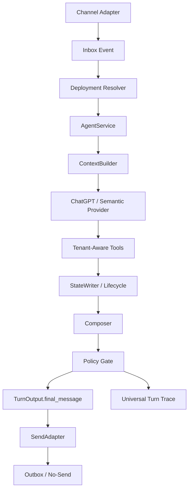
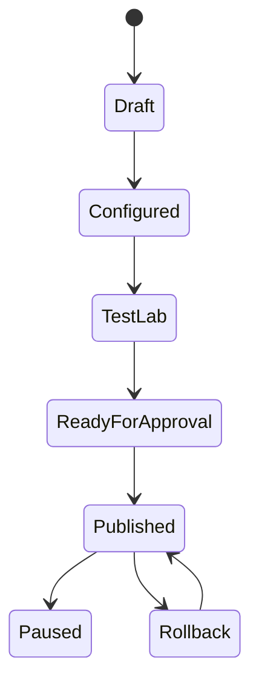

# Arquitectura-Deseada.md

## Canonical Status

`Arquitectura-Deseada.md` is the canonical source for the Product-First
transformation of AtendIA.

`ARCHITECTURE.md` remains the stable high-level system summary.

`AGENTS.md` remains the operational rulebook for Codex work.

`docs/architecture/` contains current contracts and architectural decisions.

`reports/` contains historical evidence, audits, simulations, and incidents. If
reports conflict with this document, this document wins for future Product-First
implementation.

## Executive Vision

AtendIA must stop behaving like a patched runtime and become a Product-First
platform for configurable AI agents. The target product path is:

Inbox -> Agent Builder -> Knowledge Sources -> Actions -> Workflows -> Test Lab
-> Publish Control -> Single Runtime -> Trace/Analytics.

The goal is not to make one Dinamo smoke work. The goal is a tenant-aware
platform where each business can configure, test, publish, operate, rollback,
and audit AI agents without hardcoding tenant behavior into shared runtime code.

## What AtendIA Is Building

AtendIA is building a multi-tenant agent platform with:

- A control plane where tenants configure product entities.
- A runtime plane where one AgentService executes customer turns.
- DB-backed Test Lab and Publish Control before live traffic.
- Tenant-aware Knowledge Sources, tools, actions, workflows, state, and policy.
- Universal traces that explain every visible response, state write, side
  effect decision, and send decision.

## What AtendIA Must Stop Doing

AtendIA must stop:

- Treating smoke tests as architecture.
- Using fixture-only tests as live readiness.
- Letting legacy and Runtime V2 race as visible response paths.
- Letting workflows, fallbacks, recovery code, adapters, or tools write customer
  copy.
- Adding keyword-routing patches to shared runtime.
- Hardcoding Dinamo, credit, motos, prices, requirements, plans, or vertical
  language into core runtime.
- Sending generic progress copy such as "reviso el contexto" or "te doy
  continuidad" to customers.
- Using dispersed flags as the only publication model.

## Non-Negotiable Principles

1. ChatGPT converses and reasons. AtendIA governs.
2. One AgentService owns visible response, state, tools, actions, handoff, and
   send decision.
3. `TurnOutput.final_message` is the only customer-facing text authority.
4. Tools and actions return structured data, not final customer copy.
5. No-send and live use the same DB-backed runtime path; only SendAdapter
   differs.
6. Required tool missing/skipped/failed/blocked means no-send.
7. Policy failure means no-send.
8. Internal text, `/goal`, prompts, traces, debug, recoveries, and errors never
   reach customers.
9. Legacy cannot touch published Runtime V2 tenants except through approved
   migration adapters.
10. Workflows cannot overwrite the primary conversation response.
11. Tenant-specific behavior lives in tenant config, domain contracts, Knowledge
    OS, or published tenant data.
12. No live activation happens without DB-backed Test Lab, Publish Control, and
    explicit approval.

## Control Plane

The control plane is where AtendIA configures the product. It must become the
source for:

- Agent
- Agent Version
- Agent Deployment
- Prompt Blocks
- Knowledge Sources
- Source Bindings
- Action Registry
- Action Bindings
- Field Policies
- Workflow Bindings
- Test Suites
- Publish State
- Rollback Version
- Feature Readiness

Control plane data is tenant-scoped, versioned, auditable, and publish-gated.

Detailed Product-First entity ownership, relationships, and runtime boundaries
are defined in `docs/architecture/product_first_product_entities.md`.

## Runtime Plane

The runtime plane is where AtendIA executes one customer turn:

The runtime never embeds tenant business rules directly. It loads them from the
control plane, tenant config, domain contracts, Knowledge OS, or published data.

Detailed single-route ownership, request/result contracts, SendAdapter
boundary, fail-closed behavior, and legacy visible-output limits are defined in
`docs/architecture/product_first_runtime_single_route.md`.

## Agent Builder

Agent Builder is not just a prompt editor. It must configure:

- identity, role, objective, tone, and language policy
- prompt blocks and policy blocks
- knowledge source bindings
- allowed tools and action bindings
- fields the agent can read/write
- lifecycle stages the agent can move
- handoff rules
- workflow bindings
- test suites and publish gates
- deployment status and rollback target

Agents must run from immutable published versions, not mutable drafts.

Detailed Agent Builder tabs, permissions, publish flow, blockers, and non-goals
are defined in `docs/architecture/product_first_agent_builder.md`.

## Knowledge Sources

Knowledge Sources are product entities. They must expose:

- source status and health
- file/FAQ/catalog/requirements/policy type
- parse/index status
- freshness/checksum/version
- agent bindings
- retrieval preview
- failed source blockers

If a response depends on a source and that source is missing or unhealthy, the
agent must not invent an answer. It must clarify, no-send, or handoff based on
policy.

Detailed source lifecycle, source health, Source Binding, retrieval preview,
publish blocker, runtime, and trace requirements are defined in
`docs/architecture/product_first_knowledge_sources.md`.

## Action Registry

Action Registry is the boundary for side effects and external integrations.

Actions must define:

- input schema
- output schema
- tenant permissions
- read/write/critical risk level
- dry-run/live mode
- approval policy
- idempotency strategy
- timeout/retry policy
- redacted trace payload

Tools resolve facts. Actions produce or request side effects. They must not be
mixed as one undifferentiated mechanism.

Detailed Action Definition, Action Binding, execution mode, approval,
idempotency, retry, audit, publish blocker, runtime, and trace requirements are
defined in `docs/architecture/product_first_action_registry.md`.

## Workflows

Workflows consume normalized business events. They do not write or replace
primary customer copy.

Allowed workflow role:

- route tasks
- notify teams
- update internal process state
- trigger approved automations
- consume agent events after policy/trace

Blocked workflow role:

- overwrite `TurnOutput.final_message`
- send customer text outside SendAdapter
- create side effects in no-send/Test Lab
- run for published Runtime V2 agents without explicit binding and policy

Detailed Workflow Binding, normalized event, customer-copy boundary,
side-effect mode, loop guard, publish blocker, runtime, and trace requirements
are defined in `docs/architecture/product_first_workflow_bindings.md`.

## DB-Backed Test Lab

Test Lab must run the same route as live:

- real tenant
- real agent version
- real source bindings
- real tools
- real StateWriter
- real Policy
- real TurnOutput
- SendAdapter in no-send mode
- actions dry-run
- workflows stubbed or side-effects disabled

Test Lab must verify:

- final message exact text
- tools required and executed
- state writes accepted/blocked
- lifecycle changes
- policy checks
- outbox pending/retry remains zero
- business side effects remain zero
- universal trace completeness

Fixtures can help unit tests but cannot prove publish or live readiness.

Detailed Test Suite, Scenario, turn execution, no-send/live-candidate parity,
evidence, assertion, and publish blocker requirements are defined in
`docs/architecture/product_first_test_lab.md`.

## Publish Control

Publish Control replaces scattered live flags with a deployment state machine:

No state transition may bypass required tests, policy gates, rollback metadata,
or explicit approval where live traffic is involved.

Detailed deployment states, publish request contract, readiness gates,
approvals, send scopes, rollback, feature readiness, and DoR/DoD dependencies
are defined in `docs/architecture/product_first_publish_control.md`.

## Inbox Trace And Debug

Every customer-visible answer must be traceable from Inbox:

- inbound event
- active deployment and agent version
- context used
- ChatGPT interpretation
- required tools
- tool results
- StateWriter accepted/blocked writes
- lifecycle decision
- action/workflow decisions
- policy checks
- send decision
- final visible message

Trace is internal. Trace text never becomes customer copy.

Detailed Inbox Trace UX surfaces, panels, redaction, Test Lab, Publish Control,
runtime, and future test requirements are defined in
`docs/architecture/product_first_inbox_trace_ux.md`.

## State And Contact Memory

State writes must be evidence-based and tenant-policy-aware.

Allowed:

- validated contact fields
- lifecycle updates with allowed transitions
- memory summaries with source evidence
- document status from document tools

Blocked:

- field writes from ambiguous text
- tenant-specific hard facts without tools
- state writes from customer promises about future documents
- overwrites of critical data without configured policy

## Expedientes And Documents

Document handling must be explicit:

- message attachments are stored as attachments
- document classification runs before state changes
- expediente evaluation decides completeness
- StateWriter writes document completion only from validated tool output
- future promises such as "te mando INE al rato" never count as received docs

## Multimodal

Multimodal support must classify and normalize non-text before it affects
conversation state:

- images through vision/document classification
- PDFs/docs through ingestion or document check
- audio through transcription before interpretation
- attachments through MIME/security checks

`[imagen]` is never a model, product, document received, or state update by
itself.

## Handoff

Handoff is a first-class product behavior:

- direct customer request for human
- low confidence
- missing required source
- policy risk
- outside scope
- configured lifecycle condition

Handoff must create traceable reason, target, status, and queue ownership.

## Policy And Safety

Policy blocks:

- unsupported factual claims
- prices without quote tool
- requirements without requirements lookup
- approval promises
- internal/debug text
- generic progress copy
- side effects without approval
- required tool failures
- workflow or fallback visible overrides

Policy failure means visible no-send.

## SendAdapter And Outbox

SendAdapter is the only route from approved `TurnOutput.final_message` to
outbox/live channel.

No-send writes trace only. Live-candidate may stage outbox only when send policy
allows it.

Outbox cannot be used to bypass runtime policy.

## Legacy Deprecation

Legacy is not deleted in this phase. It is classified first:

- KEEP
- MERGE
- DEGRADE
- BLOCK_FOR_V2
- DELETE_LATER
- UNKNOWN_NEEDS_AUDIT

Legacy may remain for migration but cannot be a parallel visible response path
for published Runtime V2 agents.

Detailed legacy isolation states, gates, runtime rules, migration rules,
publish blockers, and future test requirements are defined in
`docs/architecture/product_first_legacy_isolation.md`.

## Controlled Beta With Dinamo

Dinamo is a controlled beta tenant, not shared runtime architecture.

Dinamo-specific facts such as catalog, requirements, credit plans, prices,
document counts, buró handling, dealership language, and workflow preferences
must live in tenant-scoped configuration, Knowledge Sources, domain contracts,
or tenant-aware tool results.

Shared runtime must not hardcode Dinamo, motos, credit rules, model names,
income plans, document requirements, prices, or vertical-specific language.

Dinamo beta cannot start until DB-backed Test Lab, Publish Control, trace,
policy, rollback, and explicit scope approval pass.

Detailed Dinamo beta prerequisites, tenant-data boundary, evidence packet,
required scenarios, publish blockers, and future test requirements are defined
in `docs/architecture/product_first_controlled_beta_dinamo.md`.

## OpenAI Agent Builder Alignment

OpenAI's Agent Builder migration guidance reinforces AtendIA's Product-First
architecture: builder, preview, and deployment are product concerns; runtime,
tools, auth, permissions, and deployment validation belong to the application
that runs the agent.

What AtendIA adopts:

- Agent Builder pattern as Control Plane inspiration.
- Agents SDK pattern as AgentService runtime inspiration.
- Preview pattern as DB-backed Test Lab.
- create/deploy validation as Publish Control.
- representative input testing before publish.
- manual review of control flow, triggers, tools, permissions, and auth.

What AtendIA adapts:

- OpenAI workflow export becomes migration evidence, not production behavior.
- Workspace Agents are UX inspiration, not the tenant inbox runtime.
- Preview becomes DB-backed no-send using the same route as live.

What AtendIA rejects:

- blind workflow export as correctness proof
- fixture-only preview as publish readiness
- deterministic workflow behavior rewritten as LLM behavior without proof
- tool/auth/permission/deployment validation delegated to ChatGPT

Detailed OpenAI alignment analysis, mapping, contracts, product specs,
workflow migration plan, and ADRs are defined in:

- `docs/architecture/openai_agent_builder_migration_analysis.md`
- `docs/architecture/openai_agent_builder_to_atendia_mapping.md`
- `docs/architecture/atendia_agent_builder_contract.md`
- `docs/architecture/atendia_agent_runtime_sdk_contract.md`
- `docs/product/agent_builder_product_spec.md`
- `docs/product/agent_test_lab_spec.md`
- `docs/product/agent_publish_control_spec.md`
- `docs/architecture/workflow_to_agent_migration_plan.md`
- `docs/architecture/openai_agent_builder_alignment_adrs.md`

## Implementation Backlog

The executive implementation backlog consolidates the canonical architecture,
OpenAI alignment, feature readiness, legacy deprecation, Agent Builder contract,
Runtime SDK contract, Test Lab, Publish Control, actions, workflows, trace,
legacy isolation, and controlled Dinamo beta into ordered implementation epics.

The backlog is the bridge from planning to code. It does not authorize live,
smoke, outbox, action side effects, workflow side effects, canary, production,
or Dinamo fixes by itself.

Detailed epics, dependencies, required tests, gates, and first implementation
slice are defined in
`docs/architecture/product_first_implementation_backlog.md`.

## Feature Readiness Registry

Each product feature must have a readiness state:

- not_started
- implemented
- connected
- shadow
- no_send_passed
- single_contact_smoke
- live_limited
- production
- blocked
- deprecated

A feature cannot advance without evidence, tests, trace, rollback, and code
review where implementation exists.

## Definition Of Ready

A phase or feature can start only when:

- phase is approved
- spec exists
- risks are known
- tests are planned
- rollback is defined
- legacy impact is classified
- live is not touched unless explicitly approved

Details live in `docs/architecture/product_first_definition_of_ready.md`.

## Definition Of Done

A feature can be called done only when:

- UI/API/DB/runtime wiring exists as applicable
- Test Lab or relevant automated tests pass
- 100% of new or modified behavior is covered
- trace is visible and complete
- policy gate passes
- rollback is documented
- no legacy interference remains
- no fixtures-only evidence is used for live readiness

Details live in `docs/architecture/product_first_definition_of_done.md`.

## Migration Phases

1. Fase 0 - Freeze / stop patching
2. Fase 1 - Architecture alignment
3. Fase 2 - Product entities
4. Fase 3 - Agent Builder
5. Fase 4 - Knowledge Sources productized
6. Fase 5 - Runtime single route
7. Fase 6 - DB-backed Test Lab
8. Fase 7 - Publish Control
9. Fase 8 - Action Registry
10. Fase 9 - Workflow bindings
11. Fase 10 - Inbox trace UX
12. Fase 11 - Legacy isolation
13. Fase 12 - Controlled beta with Dinamo
14. Fase 13 - OpenAI Agent Builder alignment
15. Fase 14 - Product-First implementation backlog

## Acceptance Criteria

The Product-First transformation is ready to implement only when:

- spec-kit exists
- constitution exists
- active spec/plan/tasks exist
- legacy deprecation plan exists
- feature readiness matrix exists
- ADRs exist
- Definition of Ready exists
- Definition of Done exists
- acceptance tests are documented
- AGENTS and ARCHITECTURE are aligned
- Dinamo is documented as controlled beta tenant data, not shared runtime logic
- OpenAI Agent Builder migration guidance is mapped to AtendIA contracts
- Product-First implementation backlog is ready
- live was not touched
- no smoke was run
- no runtime feature was implemented outside the plan

Final documentary decision for this phase:

`SPEC_KIT_PRODUCT_FIRST_PLAN_READY`
