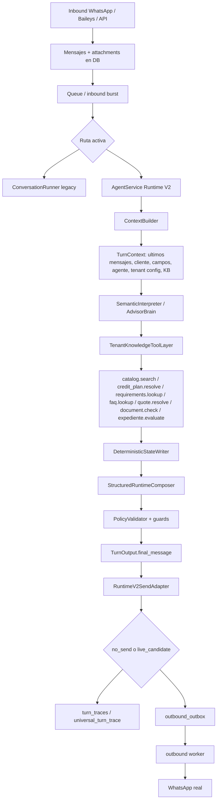

# Auditoria real de features del Agente IA Configurable

Fecha: 2026-06-06  
Repo auditado: `C:\Users\Sprt\Documents\Proyectos IA\AtendIA-v2`

## Veredicto corto

AtendIA ya tiene una base grande y real para un agente IA configurable: agentes por tenant, Knowledge OS, conversaciones, campos de contacto, pipelines, workflows, handoff, outbox, trazas y Runtime V2.

Pero no todo esta listo como producto live confiable. Hay tres realidades distintas:

1. **Existe y esta conectado en codigo**: hay rutas, modelos, UI, tests y flujo operativo.
2. **Existe parcial**: hay piezas reales, pero no esta cerrado end-to-end o esta detras de flags/gates.
3. **No existe confiable aun**: hay intencion o piezas sueltas, pero no se puede prometer como feature lista.

El punto mas delicado hoy no es que falten todos los modulos. El punto delicado es que Runtime V2, legacy runner, composer determinista, policy, tools, workflows y send adapter conviven. Eso permite avanzar, pero tambien puede producir respuestas repetidas o roboticas si el camino live cae en una rama de seguridad/composer fijo.

## Alcance de la auditoria

Revise la estructura real del repo y evidencia en:

- Backend principal: `core/atendia/`
- Runtime IA: `core/atendia/agent_runtime/`
- Runner legacy/live: `core/atendia/runner/`
- APIs: `core/atendia/api/`
- DB/migraciones/modelos: `core/atendia/db/`
- Workflows/queue/outbox: `core/atendia/workflows/`, `core/atendia/queue/`
- Knowledge/RAG/tools: `core/atendia/knowledge/`, `core/atendia/tools/`
- Frontend: `frontend/src/features/`
- Specs: `docs/architecture/`
- Tests: `core/tests/`

No cuento dependencias generadas (`node_modules`, `.venv`, caches, `.tmp`) como producto propio.

## Leyenda

- **EXISTE CONECTADO**: hay implementacion real y camino conectado en backend/UI/tests.
- **EXISTE PARCIAL**: hay codigo real, pero falta cierre, hardening, UI completa, o pruebas/live confiable.
- **EXISTE APAGADO/GATED**: hay implementacion pero esta detras de flags, dry-run, no-send o aprobacion.
- **NO EXISTE CONFIABLE**: no se puede vender como feature lista aunque haya piezas.
- **RIESGO**: existe, pero la evidencia de smoke/live muestra que puede fallar de forma visible.

## Mapa real de como se conecta AtendIA

### Autoridades reales observadas

- `ContextBuilder` construye el contexto canonico y carga hasta 20 mensajes.
- `SemanticInterpreter` ya tiene schema estricto para interpretacion, incluyendo `income.candidate`.
- `TenantKnowledgeToolLayer` ejecuta tools de datos duros tenant-aware.
- `DeterministicStateWriter` valida antes de proponer escrituras.
- `StructuredRuntimeComposer` redacta `TurnOutput.final_message`, pero todavia contiene ramas deterministicas con copy fijo.
- `PolicyValidator` bloquea placeholders, promesas de aprobacion y frases genericas como "reviso el contexto".
- `RuntimeV2SendAdapter` es la frontera real entre no-send y live.
- `universal_turn_trace` registra interpretacion, tools, state writer, policy y output final.

## Matriz de las 25 features

| # | Feature | Estado real | Evidencia principal | Como se conecta | Falta / riesgo |
|---|---|---|---|---|---|
| 1 | Agente IA Configurable | **EXISTE PARCIAL CONECTADO** | `core/atendia/api/agents_routes.py`, `frontend/src/features/agents/components/AgentsPage.tsx`, `core/atendia/agent_runtime/schemas.py` | UI/API guardan agentes; `ActiveAgentContext` alimenta Runtime V2 con rol, tono, instrucciones, KB, acciones y politicas. | El producto tiene dos caminos vivos: legacy runner y Runtime V2. La configuracion existe, pero no todo se aplica igual en live. |
| 2 | Conversacion natural con Knowledge Base | **EXISTE PARCIAL / RIESGO** | `ContextBuilder`, `UnifiedKnowledgeProvider`, `TenantKnowledgeToolLayer`, `tools/rag`, tests de Knowledge OS | El contexto recupera conocimiento y las tools validan catalogo/FAQ/requisitos. | La conversacion natural no esta garantizada: hay composer determinista y smokes reales mostraron copy repetido. |
| 3 | Uso de Fuentes de Conocimiento | **EXISTE CONECTADO PARCIAL** | `docs/architecture/knowledge_os_v2.md`, `core/atendia/db/migrations/versions/058_knowledge_os_v2.py`, `core/atendia/knowledge/os`, `frontend/src/features/knowledge/` | `KnowledgeSource/Item/Chunk` + adapters legacy; `ContextBuilder` puede recuperar evidencia tenant-scoped. | URL/crawler/OCR/freshness y permisos finos no estan completamente cerrados. |
| 4 | Instrucciones y Prompts Personalizados | **EXISTE PARCIAL** | `AgentBody.system_prompt`, `instructions`, `tone`, `voice`, `language_policy`; `agent_config.py`; `AgentsPage.tsx` | API/UI guardan instrucciones y `ActiveAgentContext` las entrega al runtime. | Falta demostrar consistencia estricta en live y en todas las rutas legacy/v2. |
| 5 | Seguimiento de flujo conversacional | **EXISTE PARCIAL / RIESGO** | `conversation_progress.py`, `LifecycleContext`, `ConversationMemoryContext`, `runner/conversation_runner.py` | Runtime decide missing facts/pending slot; runner y pipeline guardan estado. | Smokes reales muestran repeticion de pregunta; el flujo existe pero no es confiable aun. |
| 6 | Extraccion automatica de datos del cliente | **EXISTE PARCIAL** | `AdvisorBrainStateChange`, `DeterministicStateWriter`, `field_suggestions_routes.py`, `runner/state_write_policy.py` | LLM propone campos; StateWriter valida; persistencia aplica updates. | Requiere contratos de tenant limpios; no todo dato extraido debe escribirse automaticamente. |
| 7 | Actualizacion de campos de contacto | **EXISTE CONECTADO PARCIAL** | `customer_fields_routes.py`, `customers_routes.py`, `TenantFieldPanel.tsx`, `ContactPanel`, `StateWriter` | Campos declarativos por tenant; runtime genera `field_updates`; API/UI muestran y guardan. | Politicas por campo y revision humana no estan maduras para todos los casos. |
| 8 | Gestion de etapas del ciclo de vida | **EXISTE CONECTADO PARCIAL** | `docs/architecture/lifecycle_v2.md`, `TenantPipeline`, `LifecycleUpdate`, `frontend/src/features/pipeline/` | Conversaciones tienen `current_stage`; runtime/workflows pueden mover etapas; UI pipeline las muestra. | Algunos movimientos deben seguir gated; riesgo de mover etapas sin evidencia si se habilita sin policy. |
| 9 | Activacion de Workflows internos | **EXISTE APAGADO/GATED** | `workflows/engine.py`, `workflows_routes.py`, `WorkflowEditor.tsx`, `agent_workflow_events_v2.md` | Eventos del agente pueden derivar business events y workflows. | En Runtime V2 live se ha mantenido `workflow_events_enabled=false` y side effects apagados. |
| 10 | Solicitudes HTTP e integraciones externas | **EXISTE PARCIAL/GATED** | Workflow node `http_request`, `integrations_routes.py`, `ActionRegistry.call_webhook` | Workflows pueden definir `http_request`; action layer define webhook con aprobacion humana. | No hay evidencia de marketplace/API externa madura; acciones sensibles estan gated. |
| 11 | Handoff a humano | **EXISTE CONECTADO PARCIAL** | `human_handoffs` migrations, `handoffs_routes.py`, `HandoffQueue.tsx`, `conversation_control/handoff_policy.py` | Runner/policies crean handoff; UI tiene cola; ownership puede pausar bot. | Runtime V2 necesita cierre operacional consistente para crear/coordinar handoffs en live. |
| 12 | Filtrado y calificacion de clientes | **EXISTE PARCIAL** | Lifecycle, field extraction, pipeline alerts, eval fixtures, `sales_advisor_decision_policy.py` | Campos + estado + pipeline permiten calificar. | No aparece como motor configurable unico de scoring listo para todos los tenants. |
| 13 | Soporte multimodal | **EXISTE PARCIAL** | `message_attachments.py`, `tools/vision.py`, `document.check`, tests `test_document_check_v2_*` | Attachments se guardan; imagenes pueden clasificarse; documentos entran a expediente. | Imagen/documentos existen. Notas de voz/transcripcion no se ve como feature completa end-to-end. |
| 14 | Seguimiento automatico de prospectos | **EXISTE CONECTADO PARCIAL** | `runner/followup_scheduler.py`, `queue/followup_worker.py`, `FollowupsConfigEditor.tsx`, tests de worker/scheduler | Despues de outbound se programan followups; inbound cancela pendientes; worker los encola. | Debe validarse por tenant y canal antes de activar masivamente. |
| 15 | Manejo multilingue | **EXISTE COMO CONFIG PARCIAL** | `language`, `language_policy`, `tools/rag/prompt_builder.py` TODO multi-language | Agente guarda idioma/politica; prompts pueden usarlo. | No hay evidencia de deteccion/cambio de idioma robusto y probado end-to-end. |
| 16 | Asignacion a equipos o asesores | **EXISTE PARCIAL** | `ActionRegistry.assign_conversation`, workflow node `assign_agent`, `advisor_pools`, conversations `assigned_agent_id` | Accion/workflow/API pueden asignar conversaciones o agentes. | Necesita reglas de asignacion tenant-aware y ejecucion live con aprobacion/guardrails. |
| 17 | Etiquetado automatico | **EXISTE PARCIAL** | `ActionRegistry.add_tag`, conversation/customer tags, workflow trigger `tag_updated` | Accion puede agregar tags; conversaciones/clientes tienen tags. | Falta producto completo de reglas/labels automaticos confiables por tenant. |
| 18 | No salirse del personaje | **EXISTE PARCIAL / RIESGO** | `instructions`, `tone`, `voice`, `PolicyValidator`, prompt specs | Config del agente alimenta la respuesta y policy bloquea algunos riesgos. | No hay evaluador fuerte de personaje; respuestas roboticas muestran que tono/persona no siempre gobierna. |
| 19 | No inventar informacion | **EXISTE PARCIAL CON GUARDS** | `mandatory_tools.py`, `quote_safety.py`, `PolicyValidator`, `ToolExecutionResult` sin texto visible | Tools validan hechos; policy bloquea placeholders/promesas; StateWriter exige evidencia. | Existe el guardrail, pero aun puede responder mal/generico si falla el contexto o composer. |
| 20 | Respuestas no roboticas | **NO EXISTE CONFIABLE / RIESGO ALTO** | `StructuredRuntimeComposer` tiene frases fijas; policy bloquea algunas genericas | Composer decide `final_message`. | Los smokes reales probaron repeticion. Falta Composer humano real o evaluador de naturalidad en ruta live. |
| 21 | Control de limites y seguridad | **EXISTE CONECTADO PARCIAL** | `PolicyValidator`, `send_policy.py`, `safe_mode`, rollout/readiness docs, business_event_ledger | Output y acciones pasan por policy; envio pasa por send adapter; workflows pueden quedar dry-run. | El control existe, pero su UX de recuperacion no esta madura: puede bloquear o repetir sin resolver. |
| 22 | Automatizacion sin reconstruir procesos existentes | **EXISTE ARQUITECTURA PARCIAL** | Workflows engine, agent workflow events, action layer, existing pipeline/handoff/outbox | Runtime puede emitir eventos a workflows; workflows usan nodos existentes. | Falta probar mas tenants reales y publicar contratos estables de eventos. |
| 23 | Acciones configurables | **EXISTE PARCIAL/GATED** | `ActionRegistry`, `ActionDefinition`, `enabled_action_ids`, `agent_config.py` | Agente define acciones habilitadas; policy valida riesgo/evidencia/aprobacion. | La ejecucion sensible esta dry-run/human approval; falta UI completa de permisos por accion. |
| 24 | Manejo de archivos adjuntos mediante Workflow | **EXISTE PARCIAL** | `message_attachments.py`, `document.check`, `expediente.evaluate`, workflow events `document_accepted/rejected/docs_complete_for_plan` | Archivos se guardan; document tool clasifica; eventos pueden alimentar workflows. | No esta demostrado como workflow productizado completo para todos los tenants. |
| 25 | Trazabilidad de decisiones | **EXISTE CONECTADO FUERTE** | `universal_turn_trace.py`, `turn_traces_routes.py`, `frontend/src/features/turn-traces/`, tests `test_universal_turn_trace.py` | Cada turno puede registrar contexto, GPT, tools, validacion, state writer, policy, final output y eventos. | Falta usar esta trazabilidad como gate automatico de producto, no solo debug/auditoria. |

## Lo que existe realmente por capa

### Backend/API

Existe backend real para:

- Agentes: `core/atendia/api/agents_routes.py`
- Knowledge: `core/atendia/api/knowledge_routes.py`
- Workflows: `core/atendia/api/workflows_routes.py`
- Conversaciones/clientes/campos: `customers_routes.py`, `customer_fields_routes.py`, `field_suggestions_routes.py`
- Handoffs: `handoffs_routes.py`, `api/_handoffs/command_center.py`
- Integraciones: `integrations_routes.py`
- Runtime V2/testing: `agent_runtime_v2_routes.py`
- Trazas: `turn_traces_routes.py`

### Frontend

Existe UI real para:

- Agentes: `frontend/src/features/agents/`
- Knowledge Base: `frontend/src/features/knowledge/`
- Workflows: `frontend/src/features/workflows/`
- Conversaciones/contact fields: `frontend/src/features/conversations/`
- Clientes: `frontend/src/features/customers/`
- Pipeline: `frontend/src/features/pipeline/`
- Handoff queue: `frontend/src/features/handoffs/`
- Trazas: `frontend/src/features/turn-traces/`
- Config/followups/integraciones: `frontend/src/features/config/`

### DB y persistencia

Existe estructura real para:

- `turn_traces`
- `outbound_outbox`
- `business_event_ledger`
- `knowledge_sources/items/chunks`
- `human_handoffs`
- `followups_scheduled`
- `workflows/executions/action_runs`
- `customers`, `customer_fields`, `conversations`
- `tenant_config`, `tenant_catalogs`, `tenant_faqs`

### Runtime IA

Piezas reales:

- `ContextBuilder`: contexto con mensajes, contacto, agente, tenant config, KB.
- `SemanticInterpreter`: ChatGPT con JSON schema y fallback seguro.
- `TenantKnowledgeToolLayer`: tools estructuradas tenant-aware.
- `DeterministicStateWriter`: acepta/bloquea escrituras.
- `PolicyValidator`: validacion final.
- `RuntimeV2SendAdapter`: no-send/live.
- `universal_turn_trace`: auditoria por turno.

Riesgo real:

- `StructuredRuntimeComposer` todavia tiene mensajes fijos. Esto explica respuestas como:
  - "Si se puede revisar; para darte el plan correcto dime como recibes tus ingresos."
  - "Tomo tu mensaje y reviso el siguiente paso con el contexto actual." en rutas previas.
- Aunque `PolicyValidator` ya bloquea copy generico, si el output queda en una rama repetitiva "permitida", el cliente lo percibe robotico.

## Puntos conectados entre si

### Agent Studio -> Runtime V2

`AgentsPage.tsx` -> `agents_routes.py` -> tabla/modelo `Agent` -> `ActiveAgentContext` -> `ContextBuilder` -> `SemanticInterpreter/AdvisorBrain`.

Esto existe. El riesgo es que legacy y Runtime V2 no consumen exactamente igual toda la configuracion.

### Knowledge -> Respuesta

`KnowledgeBasePage.tsx` -> `knowledge_routes.py` -> `KnowledgeSource/Item/Chunk` -> `UnifiedKnowledgeProvider` -> `ContextBuilder.knowledge_citations` -> `TenantKnowledgeToolLayer` -> `TurnOutput`.

Esto existe. El hueco es calidad/cobertura/freshness y que no todos los documentos de tenant garantizan estar cargados o activos.

### Tools -> Estado

`SemanticInterpreter.required_tools` -> `TenantKnowledgeToolLayer.execute` -> `ToolExecutionResult.field_updates` -> `DeterministicStateWriter` -> `TurnOutput.field_updates` -> persistencia en `AgentService`.

Esto existe y es una de las partes mas importantes. El core correcto es: ChatGPT propone, tool valida, StateWriter escribe solo lo validado.

### Runtime -> WhatsApp real

Inbound -> `AgentService.handle_turn` -> `TurnOutput.final_message` -> `RuntimeV2SendAdapter` -> `outbound_outbox` -> worker -> canal WhatsApp.

Esto existe. Para live, la diferencia entre no-send y live debe ser solo SendAdapter. Hay tests recientes para esa paridad, pero los smokes reales muestran que todavia hay fallas de comportamiento visible.

### Runtime -> Workflows

`TurnOutput` + trace -> `business_events` -> `business_event_ledger` -> workflow bridge/engine -> side effects.

Existe como arquitectura y tests. En los gates recientes se ha mantenido apagado para seguridad.

### Runtime -> Traceability

`TurnContext` + `AdvisorBrainDecision` + `ToolExecutionResult` + `StateWriteResult` + `TurnOutput` -> `universal_turn_trace` -> `turn_traces` -> UI `turn-traces`.

Esto existe fuerte. Deberia convertirse en el panel principal para explicar por que una respuesta salio robotica.

## Gaps criticos reales

1. **Naturalidad no esta cerrada.** Hay schema semantico real, pero el composer final todavia puede caer en frases fijas. Eso contradice la feature "respuestas no roboticas".

2. **Hay doble runtime.** `ConversationRunner` legacy sigue vivo y Runtime V2 tambien. Esto complica saber que camino respondio en trafico real si no se consulta `turn_traces`.

3. **Workflows/actions existen pero no deben venderse como live full.** Hay engine y action registry, pero side effects se han mantenido apagados por seguridad en Runtime V2.

4. **Multimodal es parcial.** Imagenes/documentos existen; voz/audio no aparece como end-to-end robusto.

5. **Multilingue es configuracion, no garantia.** Hay `language_policy`, pero faltan pruebas/flujo de deteccion y cambio real por usuario.

6. **Handoff existe, pero la coordinacion runtime-live debe validarse.** DB/UI/rutas existen; falta asegurar que Runtime V2 lo use correctamente ante riesgos y solicitudes humanas.

7. **No hay un feature readiness registry unico.** El repo tiene muchas specs y tests, pero falta una matriz versionada que diga por feature: off, shadow, no-send, pilot, live.

## Recomendacion tecnica inmediata

Para no seguir poniendo capas encima de capas, la siguiente mejora deberia ser una matriz de readiness por feature y por tenant, no otro parche conversacional.

Propuesta:

1. Crear `docs/architecture/feature_readiness_matrix.md`.
2. Definir estados: `not_started`, `implemented`, `connected`, `shadow`, `no_send_passed`, `single_contact_smoke`, `live_limited`, `production`.
3. Agregar una verificacion automatica que lea config/runtime y diga que features estan realmente activas para un tenant.
4. En cada trace live, persistir:
   - runtime path usado,
   - composer usado,
   - semantic provider usado,
   - tools requeridas,
   - tools ejecutadas,
   - state writer accepted/blocked,
   - send adapter decision,
   - final message.
5. Bloquear publish si `final_message` viene de una rama deterministica repetitiva para un caso donde habia contexto suficiente para componer humano.

## Conclusion

AtendIA no esta en cero. Tiene una cantidad seria de infraestructura real. Pero las 25 features no estan todas listas para prometer como producto vivo.

La verdad operativa es:

- **Fuertes:** trazabilidad, DB/outbox, agentes configurables, Knowledge OS base, campos/contactos, pipeline, workflows engine, safety gates.
- **Parciales:** conversacion natural, semantic runtime live, extraction/writeback, handoff runtime, integrations, actions, followups, multimodal.
- **No confiables aun:** respuestas no roboticas garantizadas, multilingue real, voz/audio, automatizaciones live sin gating, experiencia live Runtime V2 estable.

Mientras no se cierre la naturalidad y la paridad real de runtime-live con trazas auditadas, AtendIA debe describirse como: **plataforma con agente IA configurable en fase avanzada de integracion**, no como agente autonomo productivo completamente confiable.
