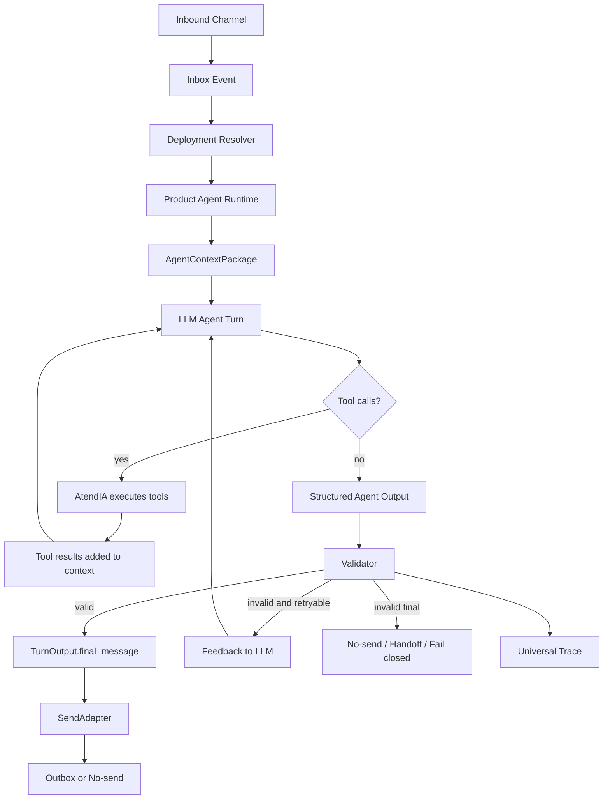

# PRODUCT_FIRST_LIVE_STABLE_IMPLEMENTATION_PROMPT.md

## Purpose

Implementar la transición real de AtendIA hacia **Product-First Live Estable**, estilo Respond.io, sin seguir construyendo bots de ifs, composers legacy ni reparaciones de copy.

Este archivo es un prompt/plan operativo para Codex.  
No es una autorización para activar WhatsApp, smoke, canary, outbox live, workflows reales ni producción abierta.

---

# /goal

Transformar AtendIA hacia un runtime Product-First Live Estable donde:

- El LLM conversa y redacta el mensaje visible.
- AtendIA carga configuración, KB, tools, actions, fields, workflows y estado.
- AtendIA valida facts, permisos, field writes, workflow triggers y send/no-send.
- AtendIA no escribe conversación visible con ifs, templates ni repairs.
- Test Lab y live usan exactamente la misma ruta.
- Legacy deja de ser ruta customer-facing para agentes publicados.
- `TurnOutput.final_message` sigue siendo la única salida visible.
- Si la respuesta del LLM no pasa validación, se reintenta con feedback estructurado o se hace fail-closed/no-send.
- No se repara con copy de plantilla.

No quiero temporales.  
No quiero legacy viviendo en la ruta nueva.  
No quiero composers customer-facing legacy.  
No quiero más patches por transcript.  
No quiero que AtendIA sea guionista conversacional.  

Quiero que AtendIA sea una plataforma de agentes IA configurables tipo Respond.io:

- Agent Builder
- Knowledge Sources
- Tools
- Actions
- Workflows
- Contact Fields
- Pipeline
- Handoff
- Test Lab
- Publish Control
- Trace
- Send/no-send
- Rollback

---

# 0. Decisión de repo: ¿nuevo proyecto o mismo repo?

## Veredicto

No crear otro proyecto desde cero.

AtendIA ya tiene demasiado valor real:

- backend multi-tenant
- inbox
- customers/contact fields
- Product Agent entities
- Agent Builder
- Knowledge Sources
- Tool/Action bindings
- Test Lab
- Publish Control
- Runtime V2
- StateWriter
- SendAdapter
- outbox
- workflows
- frontend

Crear otro proyecto solo duplicaría infraestructura y retrasaría la convergencia.

## Pero tampoco seguir encima del worktree sucio como si nada

El camino correcto es:

```txt
Mismo repo
+
nuevo baseline controlado
+
rama/worktree limpio para Product-First Live Stable
+
migración por fases
```

## Reglas para el worktree sucio

Antes de tocar runtime:

1. No hacer `git clean`.
2. No hacer `git reset`.
3. No hacer `git restore` amplio.
4. No borrar evidencia histórica.
5. No stagear/commitear sin plan.
6. Crear reporte de estado.
7. Crear lista de archivos Product-First a preservar.
8. Crear plan explícito de checkpoint.

## Fase 0 obligatoria: Baseline

Codex debe entregar primero un plan de baseline:

- estado de `git status --short`
- archivos Product-First nuevos
- archivos runtime modificados
- archivos deleted históricos
- reportes existentes
- qué se debe preservar
- qué se puede excluir
- qué requiere decisión humana
- propuesta de branch/checkpoint

Decisión esperada:

- `BASELINE_READY_FOR_PRODUCT_FIRST_REFACTOR`
- o `BLOCKED_BY_DIRTY_WORKTREE`

No implementar runtime nuevo hasta que el baseline esté claro.

---

# 1. Problema raíz

La auditoría indica que AtendIA tiene muchas piezas reales, pero todavía no es Product-First Live Estable porque:

- WhatsApp/Baileys todavía entra por `ConversationRunner`.
- Runtime V2 se engancha como prepared turn dentro del runner.
- Product Agent/Test Lab existe, pero no gobierna toda la ruta live.
- `StructuredRuntimeComposer`, `HumanResponseComposer`, `ValidatedResponsePlanBuilder`, guards y repairs todavía pueden funcionar como guionistas.
- El composer actual sigue demasiado ligado a `pending_slot`, `next_best_question`, `message_goal` y reparaciones.
- Eso produce conversación tipo formulario aunque el LLM entienda el turno.
- Las policies se están usando para corregir conversación, no solo para seguridad.
- El resultado es un híbrido: piezas product-first + ruta legacy + composer de slots.

La meta no es hacer que el composer suene un poco mejor.

La meta es eliminar la autoridad customer-facing de los composers legacy.

---

# 2. Principio arquitectónico definitivo

## AtendIA debe hacer

AtendIA es sistema operativo del agente:

- cargar tenant
- cargar agent deployment
- cargar agent version
- cargar prompt/instrucciones/persona
- cargar contact state
- cargar recent transcript
- cargar KB bindings
- cargar tool schemas
- cargar action schemas
- cargar workflow trigger schemas
- cargar field schemas
- recuperar knowledge
- ejecutar tools
- validar facts
- validar field writes
- validar workflow proposals
- validar action proposals
- validar handoff
- controlar send/no-send
- auditar
- hacer rollback
- bloquear si algo no es seguro

## ChatGPT / LLM debe hacer

El LLM es el agente conversacional:

- entender intención humana
- entender contexto y continuidad
- responder como humano
- manejar objeciones
- pedir datos faltantes naturalmente
- proponer tool calls
- proponer field updates
- proponer workflow triggers
- proponer handoff
- decidir siguiente paso conversacional
- redactar `final_message`

## AtendIA NO debe hacer

AtendIA no debe:

- escribir customer copy con ifs
- tener plantillas visibles de conversación
- reparar conversación con frases fijas
- convertir `pending_slot` en pregunta automática
- decidir frases humanas
- usar blocked phrase lists como estrategia principal de calidad
- simular conversación humana con árboles de decisión
- permitir workflow/fallback/recovery copy
- dejar que legacy escriba customer-facing text para agentes publicados

---

# 3. Arquitectura objetivo: Respond-Style Agent Runtime

## Flujo completo

```txt
Channel Adapter
→ Inbox Event
→ Deployment Resolver
→ Product Agent Runtime
→ Agent Context Package
→ LLM Turn
→ Structured Agent Output
→ Tool Execution Loop
→ Field Validation
→ Workflow/Action Validation
→ Validator
→ LLM Retry with feedback if invalid
→ Final Decision
→ SendAdapter no-send/live
→ Trace
```

## Diagrama



---

# 4. Nuevo contrato de turno

Crear un nuevo módulo, sin conectar live al principio:

```txt
core/atendia/agent_runtime/respond_style_turn_contract.py
```

## Entidades mínimas

### AgentTurnInput

```json
{
  "tenant_id": "...",
  "agent_deployment_id": "...",
  "agent_version_id": "...",
  "contact_id": "...",
  "conversation_id": "...",
  "inbound_message": {
    "text": "...",
    "attachments": []
  },
  "mode": "no_send"
}
```

### AgentContextPackage

Debe incluir:

```json
{
  "agent": {
    "name": "Francisco",
    "role": "asesor",
    "tone": "humano, WhatsApp, breve",
    "instructions": "...",
    "prompt_blocks": []
  },
  "recent_transcript": [],
  "contact_state": {},
  "visible_fields": [],
  "field_schemas": [],
  "knowledge_bindings": [],
  "retrieved_knowledge": [],
  "tool_schemas": [],
  "action_schemas": [],
  "workflow_trigger_schemas": [],
  "handoff_rules": [],
  "hard_policies": [],
  "send_mode": "no_send"
}
```

### LLMAgentTurnOutput

El LLM debe devolver structured output:

```json
{
  "final_message": "mensaje humano",
  "requested_tools": [
    {
      "name": "catalog.search",
      "arguments": {}
    }
  ],
  "proposed_field_updates": [
    {
      "field": "employment_seniority",
      "value": 15,
      "evidence": "15 meses",
      "confidence": 0.95
    }
  ],
  "proposed_workflow_events": [
    {
      "event": "quote_requested",
      "payload": {}
    }
  ],
  "handoff_request": null,
  "next_step": "ask_income_type",
  "confidence": 0.9,
  "claims": [
    {
      "text": "La Metro cuesta...",
      "basis_type": "tool_result",
      "basis_id": "quote.resolve"
    }
  ]
}
```

### ValidationResult

```json
{
  "valid": true,
  "errors": [],
  "retryable": false,
  "feedback_for_llm": null,
  "accepted_field_updates": [],
  "blocked_field_updates": [],
  "accepted_workflow_events": [],
  "blocked_workflow_events": [],
  "send_decision": "no_send"
}
```

### RetryInstruction

Si falla:

```json
{
  "validation_errors": [
    {
      "code": "PRICE_WITHOUT_QUOTE_TOOL",
      "message": "Final message contains price but quote.resolve did not run."
    }
  ],
  "allowed_facts": {},
  "instruction": "Rewrite the response without price or request quote.resolve first."
}
```

### FinalTurnDecision

```json
{
  "final_message": "...",
  "send_decision": "no_send",
  "field_updates": [],
  "workflow_events": [],
  "trace_id": "...",
  "model_usage": {},
  "validation": {}
}
```

---

# 5. Input - Processing - Output: diseño detallado

## Caso A: saludo simple

### Input

```txt
Cliente: hola
```

### Processing

AtendIA carga:

```json
{
  "recent_transcript": [],
  "contact_state": {
    "employment_seniority": null,
    "income_type": null,
    "selected_model": null
  },
  "business_context": {
    "agent_goal": "ayudar con credito de moto",
    "first_required_fact": "employment_seniority"
  },
  "hard_policies": [
    "no prices without quote tool",
    "no requirements without requirements lookup",
    "no internal text",
    "no unsupported claims"
  ]
}
```

LLM decide:

```json
{
  "final_message": "Hola, claro. Te ayudo con el crédito; primero dime ¿cuánto tiempo llevas trabajando o con tu actividad?",
  "requested_tools": [],
  "proposed_field_updates": [],
  "next_step": "collect_employment_seniority"
}
```

AtendIA valida:

- no price
- no requirements
- no field writes
- no tools needed
- safe message
- send_mode no_send/live depending gate

### Output

```txt
Hola, claro. Te ayudo con el crédito; primero dime ¿cuánto tiempo llevas trabajando o con tu actividad?
```

AtendIA no escribió esa frase.  
El LLM la escribió.  
AtendIA solo validó.

---

## Caso B: antigüedad

### Input

```txt
Cliente: 15 meses
```

### Processing

AtendIA context:

```json
{
  "last_bot_question": "¿cuánto tiempo llevas trabajando?",
  "field_schemas": [
    {
      "field": "employment_seniority",
      "type": "number_months",
      "write_allowed": true
    },
    {
      "field": "cumple_antiguedad",
      "type": "boolean",
      "derived_from": "employment_seniority >= 6"
    }
  ]
}
```

LLM output:

```json
{
  "final_message": "Perfecto, con 15 meses sí cumples. Ahora dime cómo recibes tus ingresos para ubicar tu plan.",
  "proposed_field_updates": [
    {
      "field": "employment_seniority",
      "value": 15,
      "evidence": "15 meses",
      "confidence": 0.98
    },
    {
      "field": "cumple_antiguedad",
      "value": true,
      "evidence": "15 meses >= 6 meses",
      "confidence": 0.98
    }
  ],
  "next_step": "collect_income_type"
}
```

AtendIA validates:

- field exists
- write allowed
- evidence present
- derived rule valid
- message does not leak internals

### Output

```txt
Perfecto, con 15 meses sí cumples. Ahora dime cómo recibes tus ingresos para ubicar tu plan.
```

---

## Caso C: pregunta de requisitos sin plan

### Input

```txt
Cliente: que ocupo
```

### Processing

AtendIA context:

```json
{
  "contact_state": {
    "cumple_antiguedad": true,
    "income_type": null,
    "plan_credito": null
  },
  "tools": [
    {
      "name": "requirements.lookup",
      "requires": ["plan_credito"]
    }
  ]
}
```

LLM output:

```json
{
  "final_message": "Te paso la lista correcta, solo que cambia según cómo compruebas ingresos. Dime si te pagan por nómina, tienes negocio o lo manejas por tu cuenta.",
  "requested_tools": [],
  "proposed_field_updates": [],
  "next_step": "collect_income_type"
}
```

AtendIA validates:

- no requirements listed
- no unsupported documents
- no invented plan
- safe

### Output

```txt
Te paso la lista correcta, solo que cambia según cómo compruebas ingresos. Dime si te pagan por nómina, tienes negocio o lo manejas por tu cuenta.
```

---

## Caso D: comerciante ambiguo

### Input

```txt
Cliente: soy comerciante
```

### Processing

AtendIA context:

```json
{
  "flow_policy": {
    "business_activity": {
      "ambiguous_until": "tax_status_known",
      "clarify": "SAT/RIF vs sin comprobantes"
    }
  },
  "tools": [
    {
      "name": "credit_plan.resolve",
      "requires": ["income_signal_or_tax_status"]
    }
  ]
}
```

LLM output:

```json
{
  "final_message": "Va, ¿tu negocio está dado de alta en SAT/RIF o lo manejas por fuera?",
  "requested_tools": [],
  "proposed_field_updates": [],
  "next_step": "clarify_business_tax_status"
}
```

AtendIA validates:

- no plan written
- no quote
- no requirements
- appropriate clarification

### Output

```txt
Va, ¿tu negocio está dado de alta en SAT/RIF o lo manejas por fuera?
```

---

## Caso E: comerciante sin SAT

### Input

```txt
Cliente: no tengo SAT
```

### Processing

LLM can request tool:

```json
{
  "requested_tools": [
    {
      "name": "credit_plan.resolve",
      "arguments": {
        "business_tax_status": "no_tax_registration"
      }
    }
  ]
}
```

AtendIA executes:

```json
{
  "tool": "credit_plan.resolve",
  "result": {
    "plan_credito": "Sin Comprobantes",
    "enganche": "20%",
    "plan_id": "sin_comprobantes_20"
  }
}
```

LLM composes after tool result:

```json
{
  "final_message": "Va, entonces lo manejamos como Sin Comprobantes con 20% de enganche. Dime qué modelo quieres revisar.",
  "proposed_field_updates": [
    {
      "field": "plan_credito",
      "value": "Sin Comprobantes",
      "basis": "credit_plan.resolve"
    },
    {
      "field": "enganche",
      "value": "20%",
      "basis": "credit_plan.resolve"
    }
  ],
  "next_step": "collect_model"
}
```

AtendIA validates:

- plan came from tool
- field writes evidence
- no requirements yet
- safe

### Output

```txt
Va, entonces lo manejamos como Sin Comprobantes con 20% de enganche. Dime qué modelo quieres revisar.
```

---

## Caso F: objeción de precio

### Input

```txt
Cliente: está caro
```

### Processing

AtendIA context:

```json
{
  "last_quote": {
    "model": "Metro 125 CC",
    "plan": "20%",
    "down_payment": "$6,279",
    "payment": "$1,017"
  },
  "available_tools": [
    "catalog.search",
    "quote.resolve"
  ]
}
```

LLM output:

```json
{
  "final_message": "Sí, entiendo. Podemos revisar una opción más económica o ver si con más enganche baja el pago. ¿Quieres que comparemos una más barata?",
  "requested_tools": [],
  "next_step": "offer_cheaper_or_higher_down_payment"
}
```

AtendIA validates:

- no repeated quote
- no invented new price
- safe

### Output

```txt
Sí, entiendo. Podemos revisar una opción más económica o ver si con más enganche baja el pago. ¿Quieres que comparemos una más barata?
```

---

## Caso G: workflow trigger

### Input

```txt
Cliente: sí, quiero que me contacten
```

### Processing

LLM output:

```json
{
  "final_message": "Va, te paso con Francisco para que lo revise directo contigo.",
  "proposed_workflow_events": [
    {
      "event": "handoff_requested",
      "reason": "customer_requested_human"
    }
  ],
  "handoff_request": {
    "target": "sales_team",
    "priority": "normal"
  }
}
```

AtendIA validates:

- workflow binding exists
- handoff action allowed
- no live side effects if no-send
- trace generated

### Output

```txt
Va, te paso con Francisco para que lo revise directo contigo.
```

In no-send:

```txt
workflow dry-run
handoff not executed live
trace records proposal
```

In live, only if allowed:

```txt
handoff created
conversation assigned
```

---

# 6. Qué pasa con composers actuales

## StructuredRuntimeComposer

Estado futuro:

```txt
BLOCK_FOR_PRODUCT_FIRST_LIVE
```

No debe usarse para agentes Product-First publicados.

Solo puede quedar para:

- legacy tenants
- tests antiguos
- migration compatibility
- internal safe diagnostics

## HumanResponseComposer

Estado futuro:

```txt
DEGRADE_TO_LEGACY_OR_SHADOW
```

No seguir evolucionándolo como solución final.

Puede quedar como:

- shadow comparison
- fallback no-send
- legacy adapter

Pero no debe ser el corazón live.

## ValidatedResponsePlanBuilder

Estado futuro:

```txt
MERGE_INTO_VALIDATOR_CONTEXT
```

No debe decidir conversación.

Puede producir:

- facts available
- missing facts
- tool requirements
- state constraints

Pero no:

- final message
- next human phrase
- template repair
- pending_slot-to-question copy

---

# 7. Validación sin árbol de decisión

La validación debe ser operacional, no conversacional.

## Validaciones buenas

- price claim requires quote.resolve
- requirement claim requires requirements.lookup
- field write requires schema/evidence
- workflow event requires binding/permission
- action requires auth/permission/idempotency
- internal text blocked
- tool failure means no-send
- source missing means no-send/handoff
- send scope must allow contact

## Validaciones malas si son la estrategia principal

- if customer says "hola"
- if customer says "que ocupo"
- if customer says "entonces"
- if customer says "eres robot"
- if customer says "está caro"
- if customer is frustrated
- if customer says "ya te dije"

Eso debe manejarlo el LLM desde contexto, no AtendIA con ifs.

---

# 8. Implementación por fases

## Fase 0 — Baseline

Objetivo:

- estabilizar repo/worktree
- preservar Product-First work
- no limpiar destructivo

Entregable:

- `BASELINE_READY_FOR_PRODUCT_FIRST_REFACTOR`

## Fase 1 — Customer Copy Kill Map

Auditar y bloquear toda fuente de copy visible fuera del nuevo runtime.

Entregable:

- `CUSTOMER_COPY_SOURCES_MAPPED`
- tabla con cada fuente y decisión: KEEP/DEGRADE/BLOCK/DELETE_LATER

## Fase 2 — Respond-Style Turn Contract

Implementar contratos sin conectar live.

Entregable:

- `RESPOND_STYLE_TURN_CONTRACT_READY`

## Fase 3 — LLM Turn Loop en no-send

Crear runtime nuevo en modo no-send/shadow.

Entregable:

- `RESPOND_STYLE_RUNTIME_SHADOW_READY`

## Fase 4 — Tool/Field/Workflow Validation

AtendIA valida propuestas del LLM.

Entregable:

- `RESPOND_STYLE_VALIDATOR_READY`

## Fase 5 — Test Lab Integration

Conectar el nuevo runtime al Test Lab.

Entregable:

- `RESPOND_STYLE_TEST_LAB_READY`

## Fase 6 — Replay Real Dinamo

Correr transcripts reales fallidos.

Entregable:

- `RESPOND_STYLE_REPLAY_GATE_PASSED`

## Fase 7 — Multi-tenant Simulation

Correr dentista, barbería, bienes raíces, autos, soporte.

Entregable:

- `RESPOND_STYLE_MULTI_TENANT_SIMULATION_PASSED`

## Fase 8 — Legacy Live Isolation

V2/Product Agent published no puede pasar por ConversationRunner copy.

Entregable:

- `LEGACY_CUSTOMER_COPY_BLOCKED_FOR_PRODUCT_AGENTS`

## Fase 9 — Live Candidate no-send parity

Misma ruta que live, SendAdapter no-send.

Entregable:

- `PRODUCT_FIRST_LIVE_CANDIDATE_NO_SEND_READY`

## Fase 10 — Controlled Smoke

Un contacto, rollback inmediato.

Entregable:

- `CONTROLLED_SMOKE_READY_FOR_APPROVAL`

## Fase 11 — Legacy Decommission

Eliminar o congelar definitivamente rutas customer-facing legacy.

Entregable:

- `LEGACY_CUSTOMER_COPY_DECOMMISSIONED`

---

# 9. Pruebas obligatorias

## Unit

- LLM output schema validation
- tool call proposal validation
- field update proposal validation
- workflow event proposal validation
- validator feedback
- retry loop
- no fallback template
- no legacy composer for Product Agent

## Integration

- Test Lab no-send
- Runtime shadow
- Tools real
- Fields real
- Workflows dry-run
- Handoff dry-run
- Trace complete
- no outbox

## Replay

- live transcript failed conversations
- Dinamo chaos cases
- robot/frustration/objection/repetition

## Multi-tenant

- dental appointment
- real estate lead
- auto quote
- ecommerce order
- service support
- soft collections

## Live readiness

- same route no-send/live-candidate
- outbox=0 before activation
- side_effects=0
- allowlist exact
- no legacy copy path
- rollback ready

---

# 10. Criterios para volver a WhatsApp

No volver a WhatsApp hasta:

- `RESPOND_STYLE_REPLAY_GATE_PASSED`
- `RESPOND_STYLE_MULTI_TENANT_SIMULATION_PASSED`
- `LEGACY_CUSTOMER_COPY_BLOCKED_FOR_PRODUCT_AGENTS`
- `PRODUCT_FIRST_LIVE_CANDIDATE_NO_SEND_READY`
- DB audit clean
- sources healthy
- tools healthy
- rollback ready
- human review of exact outputs

---

# 11. Qué NO hacer

No hacer:

- más fixes sobre `StructuredRuntimeComposer`
- más frase bloqueada como solución principal
- más smoke para descubrir conversación mala
- más policies conversacionales
- más `if user_act == X then final_message`
- más fallback visible
- más repair template
- más live por ConversationRunner para Product Agents
- más "pasó tests" sin revisar outputs
- más prompt gigante como reemplazo del runtime

---

# 12. Primer prompt de implementación para Codex

## /goal

Implementar Fase 1 y Fase 2 del Product-First Live Stable Respond-Style Runtime:

1. Customer Copy Kill Map.
2. Respond-Style Agent Turn Contract.

No conectar live.
No activar WhatsApp.
No activar smoke.
No escribir outbox.
No activar workflows/actions reales.
No limpiar worktree.
No eliminar legacy todavía.
No cambiar SendAdapter live.
No modificar CustomerRunner live behavior todavía.

## Contexto

La auditoría concluye que AtendIA tiene piezas Product-First reales, pero el live sigue contaminado por:

- ConversationRunner
- legacy composer
- StructuredRuntimeComposer
- HumanResponseComposer como guionista
- ValidatedResponsePlan slot-first
- fallback copy
- repair messages
- workflow copy
- tool failure copy
- policies conversacionales

El objetivo final es que AtendIA deje de escribir conversación y pase a validar conversación generada por el LLM.

## Tareas Fase 1 — Customer Copy Kill Map

Crear:

`docs/architecture/customer_copy_kill_map.md`

Auditar todas las fuentes de customer copy:

- StructuredRuntimeComposer
- HumanResponseComposer
- ValidatedResponsePlanBuilder
- advisor_pipeline fallbacks
- MandatoryToolGuard rewrites
- QuoteSafetyGuard rewrites
- Policy repair messages
- ConversationRunner legacy copy
- response_contract
- response_frame
- composer_prompts
- composer_openai
- workflow copy
- handoff copy
- provider fallback
- manual recovery
- tool failure messages
- SendAdapter copy if any

Para cada una:

- file
- function/class
- live/test route
- can reach customer?
- current risk
- future decision:
  - KEEP_INTERNAL_ONLY
  - BLOCK_FOR_PRODUCT_AGENT
  - DEGRADE_TO_LEGACY_ONLY
  - REPLACE_WITH_LLM_TURN
  - DELETE_LATER
- required test to block it

## Tareas Fase 2 — Respond-Style Turn Contract

Crear:

`core/atendia/agent_runtime/respond_style_turn_contract.py`

Definir dataclasses / Pydantic schemas:

- AgentTurnInput
- AgentContextPackage
- LLMToolCallProposal
- LLMFieldUpdateProposal
- LLMWorkflowEventProposal
- LLMHandoffProposal
- LLMClaim
- LLMAgentTurnOutput
- ValidationErrorItem
- AgentTurnValidationResult
- AgentTurnRetryInstruction
- FinalTurnDecision

Reglas:

- Estos contratos NO ejecutan live.
- Estos contratos NO reemplazan runtime todavía.
- Estos contratos NO llaman OpenAI todavía.
- Estos contratos NO escriben outbox.
- Estos contratos no conocen Dinamo.
- Estos contratos son genéricos multi-tenant.

## Tests obligatorios

Agregar:

- test_respond_style_turn_contract_schema.py
- test_llm_agent_turn_output_requires_final_message.py
- test_tool_call_proposal_schema.py
- test_field_update_proposal_requires_evidence.py
- test_workflow_event_proposal_requires_binding_name.py
- test_validation_result_retry_instruction.py
- test_final_turn_decision_no_send_default.py
- test_contract_has_no_dinamo_hardcode.py

## Verificación

Correr:

- ruff scoped
- pytest scoped
- no hardcode Dinamo/motos/crédito/SAT/Metro/etc.
- no send/outbox/workflow live changes

## Criterios de aceptación

Declarar:

`RESPOND_STYLE_TURN_CONTRACT_READY`

solo si:

- customer copy kill map existe
- turn contract existe
- tests pasan
- no live touched
- no legacy deleted
- no hardcode Dinamo
- docs actualizadas

## Decisiones posibles

- RESPOND_STYLE_TURN_CONTRACT_READY
- BLOCKED_BY_CUSTOMER_COPY_MAPPING
- BLOCKED_BY_SCHEMA_DESIGN
- BLOCKED_BY_TESTS
- UNSAFE_SCOPE_TOO_BROAD

---

# 13. Decisión objetivo final de este programa

La decisión final deseada antes de volver a smoke no es:

```txt
composer_fixed
```

Es:

```txt
PRODUCT_FIRST_LIVE_STABLE_READY_FOR_CONTROLLED_SMOKE
```

Y eso solo puede pasar cuando:

```txt
LLM owns customer conversation.
AtendIA owns validation/execution/audit/send.
Legacy customer copy is blocked.
Test Lab and live use same route.

---

# 14. Entregables obligatorios agregados - 2026-06-09

Este archivo queda como prompt/plan operativo principal, pero no basta solo.
Para cumplir el objetivo Product-First Live Estable, el trabajo queda anclado a
cuatro contratos adicionales:

1. `docs/architecture/product_first_legacy_decommission_plan.md`
   - define la descomision real de legacy visible-copy.
   - Product Agents publicados nunca entran por `ConversationRunner`.
   - legacy composer, fallback visible y workflow customer-copy quedan fuera de
     la ruta publicada.

2. `docs/architecture/respond_style_runtime_implementation_plan.md`
   - define `RespondStyleAgentTurn` / `LLMAgentTurn`.
   - define loop LLM -> tools -> LLM final_message -> validator.
   - define retry con feedback estructurado al LLM y fail-closed/no-send.

3. `docs/architecture/product_builder_capability_matrix.md`
   - define que Builder debe configurar prompt, KB, tools, actions, fields,
     workflow triggers, handoff, pipeline, publish, rollback y test suites.
   - bloquea publish si Builder no puede mostrar evidencia y blockers.

4. `docs/architecture/product_first_live_readiness_test_lab_rollback_gate.md`
   - convierte Test Lab misma ruta que live en gate.
   - exige replay real, simulaciones multi-tenant, outbox/side-effect zero,
     Publish Control y rollback antes de smoke.

Decision documental:

`PRODUCT_FIRST_LIVE_STABLE_DOCS_PACKAGE_READY`
