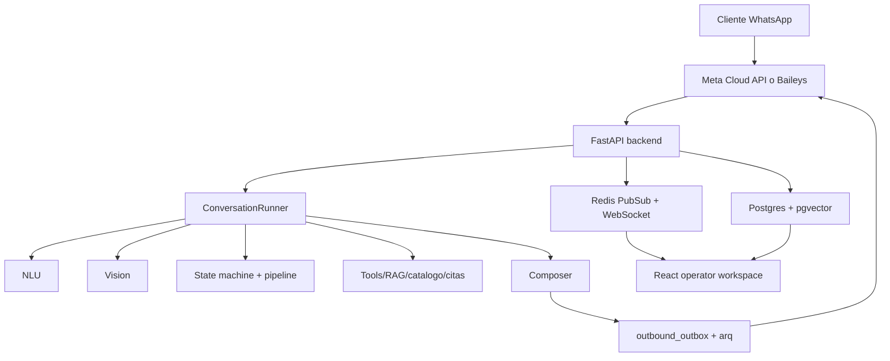
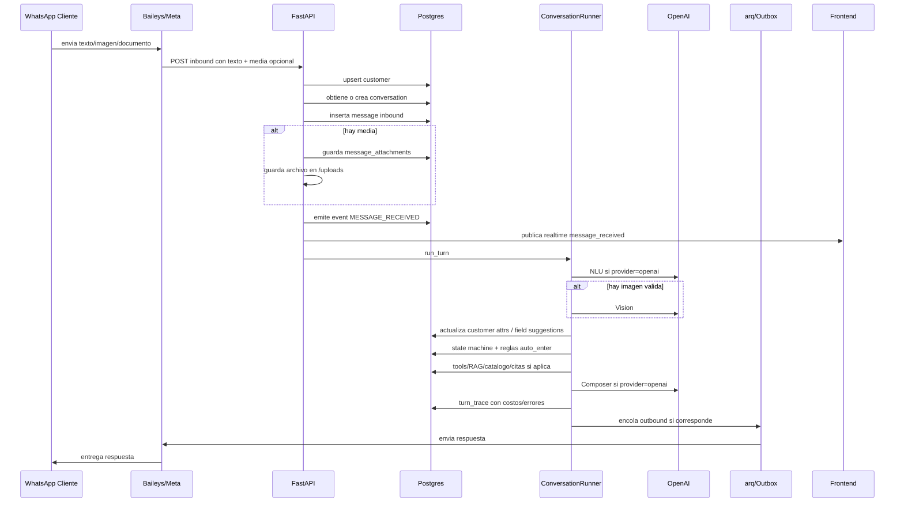

# AtendIA v2 - Mapa maestro tecnico y funcional

Revision: 2026-05-17  
Repo: `AtendIA-v2`  
Objetivo: documentar en un solo archivo las funcionalidades, categorias, programacion logica, programacion frontend, flujo actualizado de mensajes entrantes, estado comparado contra archivos/documentos anteriores y direccion recomendada.

## 1. Lectura ejecutiva

AtendIA v2 es una plataforma multi-tenant para operar conversaciones de WhatsApp con IA, CRM, pipeline comercial, handoffs humanos, knowledge base, workflows, citas, reportes y trazabilidad completa.

La arquitectura esta bien encaminada porque separa claramente:

- Canal de entrada/salida: Meta Cloud API y Baileys.
- Persistencia: Postgres con modelos por dominio y Alembic.
- Logica conversacional: `ConversationRunner`, NLU, router de flujo, state machine, tools, vision y composer.
- Operacion humana: inbox, panel de contacto, handoffs, pipeline, customers, agentes y turn traces.
- Automatizacion: workflows, workers `arq`, followups y jobs.
- Observabilidad: `events`, `turn_traces`, realtime WebSocket, debug panel y analytics.

El punto mas importante despues del debug de imagenes es este: el sistema ya no debe tratar una imagen mal procesada o una cuota OpenAI agotada como si el cliente "no se explico". Ahora hay que distinguir:

- El cliente envio media pero no se pudo leer.
- Vision fallo por cuota o error tecnico.
- NLU fallo por cuota o error tecnico.
- Composer fallo y uso fallback.
- El bot debe escalar/marcar revision humana cuando el problema es tecnico.

Tambien se actualizo el camino de multimedia: las imagenes/documentos entrantes se persisten localmente, se vinculan a `message_attachments`, se sirven por `/uploads`, se adjuntan al mensaje para la UI y ahora se muestran en el panel derecho como **Multimedia**.

## 2. Estado actual contra documentos anteriores

Los docs previos principales eran:

- `README.md`
- `core/README.md`
- `docs/PROJECT_MAP.md`
- `docs/PROJECT_MAP_DETAILED.md`

Esos documentos siguen siendo utiles, pero algunas partes ya quedaron parcialmente atrasadas.

### 2.1 Cambios importantes desde los docs anteriores

| Area | Antes documentado | Estado actualizado |
|---|---|---|
| Composer model | Se mencionaba `gpt-4o` como default real | Default cambiado a `gpt-4o-mini` para bajar costo |
| Multimedia inbound | Phase 3d.3 marcaba multimedia/blob como pendiente | Inbound multimedia por Baileys ya guarda archivos locales y DB attachments |
| Multimedia outbound | Pendiente | Sigue pendiente |
| Vision | Vision corria si habia attachment | Se reforzo: solo debe correr si hay imagen valida, y errores quedan visibles |
| Debug de costo | `turn_traces.total_cost_usd` podia quedar en 0 aunque hubiera costos por componente | Se corrigio para guardar el costo total del turno |
| Error por cuota OpenAI | Podia caer en respuestas genericas tipo "reformula" | Se registra como error tecnico y debe evitar culpar al cliente |
| UI conversaciones | Mostraba imagenes en burbujas si metadata estaba disponible | Ahora tambien hay seccion **Multimedia** en panel derecho |

### 2.2 Conclusion sobre "vamos por buen camino"

Si, vamos por buen camino. La base esta bien pensada:

- El runner es auditable.
- Los canales estan desacoplados.
- Los tenants pueden configurar pipeline, campos, agentes, branding y knowledge.
- El frontend ya esta organizado por features.
- Hay `turn_traces`, que es clave para entender por que el bot hizo algo.

Lo que falta no es rehacer el proyecto. Falta endurecer los bordes operativos:

- Mensajes multimedia de todos los tipos, no solo imagen.
- Manejo de errores OpenAI como estado operativo.
- Presupuestos/limites por tenant/conversacion.
- Tests E2E de Baileys con imagen real.
- Unificar documentos de producto para que no haya confusion entre estado viejo y nuevo.

## 3. Capas del sistema

AtendIA puede entenderse en siete capas:

1. Infraestructura local y runtime.
2. Backend FastAPI.
3. Base de datos y modelos.
4. Canales WhatsApp.
5. Motor conversacional.
6. Automatizaciones/workflows/workers.
7. Frontend operador.



## 4. Infraestructura y servicios

Archivo principal: `docker-compose.yml`

Servicios:

| Servicio | Proposito | Puerto |
|---|---|---|
| `postgres-v2` | Postgres 15 con pgvector | Host `5433`, container `5432` |
| `redis-v2` | Redis para queues y pubsub | Host `6380`, container `6379` |
| `backend` | FastAPI + uvicorn reload | `8001` |
| `frontend` | Vite dev server | `5173` |
| `worker` | Worker `arq` general | interno |
| `workflow-worker` | Worker dedicado workflows | interno |
| `baileys-bridge` | Sidecar WhatsApp Web QR | `7755` |

Puntos operativos:

- Backend monta `./core:/app`, por eso cambios Python suelen reflejarse con hot reload.
- Frontend monta `./frontend:/app`, por eso cambios UI reflejan con Vite.
- Baileys bridge no siempre queda con cambios de source si no se reconstruye. Para cambios en `core/baileys-bridge`, usar:

```bash
docker compose up -d --build baileys-bridge
```

## 5. Backend FastAPI

Entrada principal:

- `core/atendia/main.py`

Responsabilidades:

- Crear app FastAPI.
- Instalar CSRF.
- Registrar tools en lifespan.
- Montar routers `/api/v1/*`.
- Montar webhooks Meta/Baileys/workflows.
- Montar WebSocket.
- Servir `/uploads`.
- Servir frontend built en produccion si existe `frontend/dist`.

### 5.1 Routers backend por categoria

| Router | Archivo | Funcion |
|---|---|---|
| Auth | `api/auth_routes.py` | Login, logout, session, tokens |
| Conversations | `api/conversations_routes.py` | Inbox, detalle, mensajes, mark-read, editar/borrar, adjuntos |
| Customers | `api/customers_routes.py` | CRM, clientes, documentos, riesgos, AI review |
| Customer fields | `api/customer_fields_routes.py` | Definiciones y valores configurables |
| Customer notes | `api/customer_notes_routes.py` | Notas del contacto |
| Field suggestions | `api/field_suggestions_routes.py` | Sugerencias IA de datos de cliente |
| Pipeline | `api/pipeline_routes.py` | Board, etapas, movimientos, alertas |
| Agents | `api/agents_routes.py` | Agentes, prompts, guardrails, previews, versiones |
| Knowledge | `api/knowledge_routes.py`, `api/_kb/*` | FAQs, catalogo, docs, RAG, command center |
| Handoffs | `api/handoffs_routes.py`, `api/_handoffs/*` | Cola de intervencion humana |
| Workflows | `api/workflows_routes.py` | CRUD, editor, ejecuciones, versiones |
| Appointments | `api/appointments_routes.py` | Agenda/citas |
| Analytics | `api/analytics_routes.py` | Volumen, costos, funnel, handoffs |
| Reports | `api/reports_routes.py` | Reporteria |
| Exports | `api/exports_routes.py` | Exportaciones CSV |
| Notifications | `api/notifications_routes.py` | Notificaciones operador |
| Navigation | `api/navigation_routes.py` | Badges del sidebar |
| Audit | `api/audit_log_routes.py`, `api/_audit.py` | Auditoria |
| Turn traces | `api/turn_traces_routes.py` | Debug de turnos |
| Integrations | `api/integrations_routes.py` | Config integraciones |
| Baileys | `api/baileys_routes.py` | QR/status/inbound interno |
| Channel status | `api/channel_status_routes.py` | Estado de canal |
| Tenants | `api/tenants_routes.py` | Config tenant, branding, pipeline, inbox config |
| Users | `api/users_routes.py` | Usuarios |
| Runner | `api/runner_routes.py` | Run manual de turno |

## 6. Base de datos

Modelos:

- `core/atendia/db/models/*.py`

Migraciones:

- `core/atendia/db/migrations/versions/*.py`

### 6.1 Tablas principales por dominio

| Dominio | Tablas/modelos |
|---|---|
| Tenant/auth | `tenants`, `tenant_users`, `tenant_baileys_config` |
| Conversaciones | `conversations`, `conversation_state`, `conversation_reads` |
| Mensajes | `messages`, `message_attachments` |
| Eventos/debug | `events`, `turn_traces`, `tool_calls` |
| Clientes | `customers`, `customer_scores`, `customer_risks`, `customer_next_best_actions`, `customer_timeline_events`, `customer_documents`, `customer_ai_review_items` |
| Campos cliente | `customer_field_definitions`, `customer_field_values`, `field_suggestions` |
| Notas | `customer_notes` |
| Handoffs/followups | `human_handoffs`, `followups_scheduled` |
| Pipeline/config | `tenant_pipelines`, `tenant_branding` y config relacionada |
| Agentes | `agents` |
| Knowledge | `knowledge_documents`, `knowledge_chunks`, `kb_collections`, `kb_conflicts`, `kb_versions`, `kb_health_snapshots`, `kb_safe_answer_settings`, `kb_source_priority_rules`, `kb_agent_permissions`, `kb_unanswered_questions`, `kb_test_cases`, `kb_test_runs` |
| Citas/catalogo legacy | `appointments`, `advisors`, `vehicles` |
| Outbound | `outbound_outbox` |
| Notifications | `notifications` |
| Workflows | modelos en `workflow.py` |

### 6.2 Estados criticos

`conversation_state` guarda el estado vivo:

- `extracted_data`
- `last_intent`
- `bot_paused`
- `followups_sent_count`
- `total_cost_usd`
- `pending_confirmation`
- campos de etapa/tiempo

`turn_traces` guarda auditoria por turno:

- entrada normalizada
- NLU input/output/model/tokens/costo
- estado antes/despues
- accion decidida
- composer input/output/model/tokens/costo
- costo tools
- costo vision
- latencias
- errores
- reglas evaluadas
- evidencia KB

`message_attachments` guarda multimedia:

- `message_id`
- `tenant_id`
- `type`
- `mime_type`
- `storage_url`
- `caption`
- `original_filename`
- `file_size`
- `sha256`
- `status`
- `metadata_json`

## 7. Canales WhatsApp

Hay dos caminos:

1. Meta Cloud API oficial.
2. Baileys WhatsApp Web sidecar.

### 7.1 Meta Cloud API

Archivos:

- `core/atendia/webhooks/meta_routes.py`
- `core/atendia/channels/*`
- `core/atendia/queue/worker.py`

Flujo:

1. Meta manda webhook.
2. Backend valida tenant/config.
3. Persiste customer/conversation/message.
4. Emite `MESSAGE_RECEIVED`.
5. Evalua workflows.
6. Publica realtime.
7. Ejecuta runner.
8. Encola outbound.
9. Worker manda por Meta.
10. Status webhooks actualizan delivery.

### 7.2 Baileys WhatsApp Web

Archivos:

- `core/baileys-bridge/src/baileys.js`
- `core/baileys-bridge/src/webhook-client.js`
- `core/atendia/api/baileys_routes.py`
- `core/atendia/integrations/baileys_client.py`
- `core/atendia/db/models/tenant_baileys_config.py`

Funciones:

- Conectar tenant por QR.
- Guardar session auth en volumen Docker.
- Recibir mensajes.
- Resolver telefono real si WhatsApp manda LID.
- Detectar si mensaje es texto, imagen, video, documento, audio, sticker, ubicacion o contacto.
- Descargar media con Baileys.
- Enviar media base64 al backend.
- Reflejar mensajes enviados desde el telefono del operador como outbound echo.

### 7.3 Punto importante de multimedia

El sidecar no debe mandar solo `[imagen]`. Debe mandar:

```json
{
  "media": {
    "type": "image",
    "mime_type": "image/jpeg",
    "caption": null,
    "filename": null,
    "data_base64": "..."
  }
}
```

Backend:

1. Decodifica base64.
2. Guarda archivo en `uploads/<tenant_id>/<message_id>.<ext>`.
3. Crea URL publica `/uploads/...`.
4. Guarda metadata en `messages.metadata_json.media`.
5. Inserta fila en `message_attachments`.
6. Crea attachment canonico `data:<mime>;base64,...` para Vision.
7. Publica realtime con metadata para UI.

## 8. Flujo actualizado de mensaje entrante

Este es el flujo actualizado que importa para debug:



### 8.1 Paso por paso tecnico

1. Cliente envia mensaje.
2. Baileys/Meta recibe.
3. Si es Baileys, `extractMessageText()` obtiene texto/caption o placeholder.
4. Si es Baileys y hay media, `extractMessageMedia()` descarga bytes.
5. Baileys llama backend interno `/api/v1/internal/baileys/inbound`.
6. Backend valida `X-Internal-Token`.
7. Normaliza telefono a `+...`.
8. Upsert en `customers`.
9. Busca conversacion activa no borrada.
10. Si no existe, crea `conversations` y `conversation_state`.
11. Persiste media local si existe.
12. Inserta `messages` con direction `inbound`.
13. Dedup por `(tenant_id, channel_message_id)`.
14. Inserta `message_attachments` si hay media.
15. Incrementa unread.
16. Emite evento `MESSAGE_RECEIVED`.
17. Evalua workflows.
18. Publica realtime para UI.
19. Calcula `next_turn`.
20. Construye NLU y Composer segun settings.
21. Construye `CanonicalMessage` con attachments.
22. Ejecuta `ConversationRunner.run_turn`.
23. Runner carga pipeline activo.
24. Runner revisa `bot_paused`.
25. Runner obtiene estado antes.
26. Runner arma campos requeridos/opcionales para NLU.
27. Runner ejecuta NLU.
28. Si hay imagen valida, ejecuta Vision en paralelo.
29. Si Vision reconoce documento, aplica resultado a `customer.attrs` via `vision_to_attrs`.
30. Runner elimina entidades tipo documento extraidas por NLU para que Vision sea la fuente de verdad.
31. Runner aplica entidades a `conversation_state.extracted_data`.
32. Runner aplica sugerencias/attrs cliente.
33. State machine decide etapa y accion.
34. Reglas `auto_enter_rules` pueden mover etapa.
35. Flow router decide modo: PLAN, SALES, DOC, OBSTACLE, RETENTION, SUPPORT.
36. Tools corren si la accion lo requiere.
37. Composer redacta respuesta.
38. Si Composer falla, usa canned fallback y marca error.
39. Si OpenAI falla por cuota, queda en `errors` y se evita una respuesta que culpe al cliente.
40. Runner persiste `turn_traces`.
41. Runner actualiza costos acumulados.
42. Outbound se persiste y encola.
43. Worker manda por canal.
44. Frontend invalida queries por realtime y muestra mensaje/media.

### 8.2 Por que antes decia "Disculpa, no te entendi"

La causa mas probable era combinada:

- La imagen llegaba como placeholder `[imagen]` sin media real.
- Vision no tenia attachment legible.
- NLU podia fallar por quota o clasificar `unclear`.
- State machine resolvia accion `ask_clarification`.
- Composer canned devolvia texto generico.

Eso parecia culpa del cliente, pero realmente era problema tecnico de ingestion/media/cuota.

La solucion correcta no es pedir siempre reformular. Es:

- Si hay placeholder y no hay media legible: pedir reenviar como foto.
- Si hay media legible y Vision falla por quota/error: marcar revision humana/problema tecnico.
- Si NLU falla por quota: no gastar mas en composer caro y no avanzar estado de forma agresiva.
- Guardar todo en `turn_traces.errors`.

## 9. Motor conversacional

Carpeta:

- `core/atendia/runner/`

### 9.1 `ConversationRunner`

Archivo:

- `core/atendia/runner/conversation_runner.py`

Responsabilidades:

- Cargar estado conversacional.
- Cargar pipeline activo.
- Calcular campos requeridos/opcionales.
- Ejecutar NLU y Vision.
- Validar extracciones.
- Aplicar datos a `conversation_state`.
- Aplicar datos a `customer.attrs` / field suggestions.
- Ejecutar state machine.
- Evaluar `auto_enter_rules`.
- Resolver modo de flujo.
- Ejecutar tools.
- Construir input para composer.
- Encolar mensajes salientes.
- Crear eventos de sistema.
- Crear handoffs.
- Persistir `turn_traces`.
- Acumular costos.

### 9.2 NLU

Archivos:

- `runner/nlu_protocol.py`
- `runner/nlu_openai.py`
- `runner/nlu_keywords.py`
- `runner/nlu_canned.py`
- `runner/nlu_prompts.py`
- `runner/nlu/pricing.py`

Intenciones:

- `greeting`
- `ask_info`
- `ask_price`
- `buy`
- `schedule`
- `complain`
- `off_topic`
- `unclear`

Salida:

- intent
- entities
- sentiment
- confidence
- ambiguities
- usage/costo

Default actual:

- Provider: `keyword` si no se configura.
- Modelo si OpenAI: `gpt-4o-mini`.

### 9.3 Vision

Archivos:

- `tools/vision.py`
- `runner/vision_to_attrs.py`

Responsabilidades:

- Leer imagen/documento.
- Clasificar tipo de documento.
- Extraer campos visuales cuando aplica.
- Hacer quality check.
- Escribir estado de documentos en `customer.attrs`.
- Emitir eventos `DOCUMENT_ACCEPTED` / `DOCUMENT_REJECTED` si corresponde.

Regla importante:

Los documentos son propiedad de Vision, no de NLU. Si NLU "adivina" `DOCS_INE.status`, el runner debe ignorarlo.

### 9.4 State machine y pipeline

Carpeta:

- `core/atendia/state_machine/`

Archivos clave:

- `orchestrator.py`
- `transitioner.py`
- `conditions.py`
- `action_resolver.py`
- `pipeline_evaluator.py`
- `pipeline_loader.py`
- `motos_credito_pipeline.py`
- `motos_credito_pipeline.json`

Conceptos:

- Stage actual.
- Required fields.
- Actions allowed.
- Transitions.
- Auto-enter rules.
- Behavior modes.
- Pause bot on enter.
- Handoff reason.

### 9.5 Modos de flujo

El runner/composer trabaja con modos:

| Modo | Proposito |
|---|---|
| PLAN | Elegir/aclarar plan, antiguedad, esquema de credito |
| SALES | Venta, cotizacion, modelo, interes comercial |
| DOC | Documentos, INE, comprobantes, validacion visual |
| OBSTACLE | Objeciones, problemas, falta de requisitos |
| RETENTION | Retencion y seguimiento |
| SUPPORT | Dudas generales/soporte |

Estos modos permiten que el bot no sea un prompt unico gigante. La direccion buena es seguir moviendo comportamiento a configuracion por tenant/agente/pipeline, no hardcodearlo en Python.

### 9.6 Tools

Carpeta:

- `core/atendia/tools/`

Tools principales:

| Tool | Uso |
|---|---|
| `quote.py` | Cotizar/precios |
| `search_catalog.py` | Buscar catalogo por alias/semantic |
| `lookup_faq.py` | Responder FAQ/RAG |
| `lookup_requirements.py` | Requisitos por plan/docs |
| `book_appointment.py` | Agendar citas |
| `escalate.py` | Escalar humano |
| `followup.py` | Followups |
| `vision.py` | Clasificacion visual |
| `embeddings.py` | Embeddings |
| `rag/*` | Retrieval, sintesis, conflictos, safe answers |

## 10. Composer

Archivos:

- `runner/composer_protocol.py`
- `runner/composer_openai.py`
- `runner/composer_canned.py`
- `runner/composer_prompts.py`

Responsabilidad:

- Convertir accion + estado + evidencia + tono + modo en respuesta final.
- Respetar maximo de mensajes.
- Puede sugerir handoff.
- Si falla OpenAI, usa fallback canned.

Default actualizado:

- Provider: `canned` si no se configura.
- Modelo si OpenAI: `gpt-4o-mini`.

Razones:

- Reducir gasto.
- Evitar que debug de conversaciones con muchas imagenes queme saldo rapido.
- Mantener calidad razonable para respuestas operativas.

## 11. Outbound y workers

Archivos:

- `runner/outbound_dispatcher.py`
- `queue/outbox.py`
- `queue/worker.py`
- `queue/workflow_jobs.py`
- `queue/followup_jobs.py`
- `queue/force_summary_job.py`
- `queue/index_document_job.py`

Flujo outbound:

1. Runner decide mensajes.
2. Persiste messages outbound.
3. Staged outbox.
4. Encola job `send_outbound`.
5. Worker llama canal Meta/Baileys.
6. Actualiza delivery.
7. Publica realtime.

Pendiente relevante:

- Outbound multimedia real (mandar imagen/PDF desde AtendIA hacia WhatsApp).
- Templates WhatsApp para reenganche fuera de 24h.

## 12. Workflows

Archivos:

- `api/workflows_routes.py`
- `workflows/engine.py`
- `db/models/workflow.py`
- `queue/workflow_jobs.py`

Funciones:

- CRUD workflows.
- Draft/publish.
- Versiones.
- Comparacion/restore.
- Nodes/edges.
- Validacion.
- Simulacion.
- Ejecuciones.
- Safe pause.
- Retry/replay.
- Variables.
- Triggers desde eventos conversacionales.

Direccion:

Workflows deberia convertirse en la capa de automatizacion configurable para operaciones de negocio, evitando meter reglas especiales en el runner.

## 13. Knowledge Base y RAG

Archivos:

- `api/knowledge_routes.py`
- `api/_kb/collections.py`
- `api/_kb/search.py`
- `api/_kb/test_query.py`
- `api/_kb/command_center.py`
- `tools/rag/*`
- `db/models/knowledge_document.py`
- `db/models/kb_*.py`

Funciones:

- Subir documentos.
- Indexar chunks.
- Colecciones.
- Busqueda.
- Test queries.
- Preguntas sin responder.
- Conflictos.
- Prioridad de fuentes.
- Safe answer settings.
- Simulaciones.
- Health dashboard.

Estado:

- Backend bastante avanzado.
- Frontend existe, pero historicamente se marcaba como parcial.
- Debe integrarse mas claramente al composer como evidencia confiable.

## 14. Handoffs

Archivos:

- `api/handoffs_routes.py`
- `api/_handoffs/command_center.py`
- `db/models/lifecycle.py`
- `runner/handoff_helper.py`
- `frontend/src/features/handoffs/*`

Funciones:

- Crear handoff automatico.
- Cola de humanos.
- Asignar/tomar/resolver.
- Timeline.
- Draft reply.
- Recomendar agente.
- Feedback.
- Analytics.

Razones de handoff conocidas:

- Fuera de ventana 24h.
- Composer failed.
- Stage triggered handoff.
- Docs complete for plan.
- Antiguedad menor 6m.
- Obstacle no solution.
- Papeleria completa.

Observacion:

El caso que viste `Bot pausado - docs_complete_for_plan` viene de la logica de handoff por documentos completos/stage transition, no necesariamente de un texto que se haya escrito a mano en el frontend. Debe revisarse si esa regla esta demasiado agresiva para el paso de antiguedad.

## 15. Frontend

Stack:

- React 19.
- TanStack Router.
- TanStack Query.
- Tailwind v4.
- shadcn/ui vendored.
- lucide-react.
- Vite.

Entrada:

- `frontend/src/routes/*`
- `frontend/src/components/AppShell.tsx`
- `frontend/src/features/*`

### 15.1 Rutas frontend

| Ruta | Feature |
|---|---|
| `/login` | Login |
| `/dashboard` | Dashboard |
| `/conversations` | Inbox conversacional |
| `/conversations/$conversationId` | Detalle conversacion |
| `/customers` | Clientes |
| `/customers/$customerId` | Detalle cliente |
| `/pipeline` | Kanban/editor pipeline |
| `/agents` | Agentes |
| `/agents/$agentId` | Agente especifico |
| `/composer` | Editor/preview de composer modes |
| `/knowledge` | Knowledge Base |
| `/workflows` | Workflows |
| `/handoffs` | Handoffs |
| `/appointments` | Citas |
| `/analytics` | Analitica |
| `/reports` | Reportes |
| `/exports` | Exportaciones |
| `/users` | Usuarios |
| `/config` | Configuracion |
| `/customer-fields` | Campos cliente |
| `/inbox-settings` | Config inbox |
| `/turn-traces` | Debug/traces |
| `/audit-log` | Auditoria |

### 15.2 Features frontend

| Feature | Funcion |
|---|---|
| `agents` | Configurar agentes, prompts, guardrails, versiones |
| `analytics` | KPIs y graficas |
| `appointments` | Agenda y settings |
| `audit-log` | Auditoria |
| `config` | Branding, tono, integraciones, campos cliente, QoS |
| `conversations` | Inbox, chat, contacto, multimedia, debug |
| `customers` | CRM y detalle cliente |
| `dashboard` | Resumen operativo |
| `handoffs` | Cola humana |
| `inbox-settings` | Layout/reglas/filtros del inbox |
| `knowledge` | KB |
| `navigation` | Menu/badges |
| `notifications` | Notificaciones |
| `pipeline` | Kanban y editor |
| `reports` | Reportes |
| `turn-traces` | Debug IA |
| `users` | Usuarios |
| `workflows` | Automatizaciones |

## 16. Frontend de conversaciones

Archivos clave:

- `features/conversations/components/ConversationsPage.tsx`
- `features/conversations/components/ConversationDetail.tsx`
- `features/conversations/components/ChatWindow.tsx`
- `features/conversations/components/MessageBubble.tsx`
- `features/conversations/components/MediaContent.tsx`
- `features/conversations/components/ContactPanel.tsx`
- `features/conversations/components/DebugPanel.tsx`
- `features/conversations/components/SystemEventBubble.tsx`
- `features/conversations/components/InterventionComposer.tsx`
- `features/conversations/hooks/useConversations.ts`
- `features/conversations/hooks/useConversationStream.ts`
- `features/conversations/hooks/useTenantStream.ts`
- `features/conversations/api.ts`

Funciones:

- Lista de conversaciones.
- Chat con mensajes inbound/outbound/system.
- Render de media en burbujas.
- Panel derecho con identidad, detalles, documentos, multimedia, next best action, riesgos, timeline, resumen y notas.
- Intervencion humana.
- Debug panel ligado a `turn_traces`.
- Realtime invalidation.

### 16.1 Multimedia en panel derecho

Nuevo camino:

- Backend: `GET /api/v1/conversations/{conversation_id}/attachments`
- Frontend API: `conversationsApi.listAttachments`
- Hook: `useConversationAttachments`
- UI: `MultimediaSection` en `ContactPanel.tsx`

Muestra:

- Imagen miniatura si `mime_type` inicia con `image/`.
- Icono de documento si no.
- Nombre de archivo/caption/mime.
- Tipo, tamano, fecha.
- Link a `/uploads/...`.

## 17. Debug y observabilidad

Herramientas:

- `turn_traces`
- `events`
- `messages.metadata_json`
- `message_attachments`
- `frontend/src/features/turn-traces/*`
- `DebugPanel` en conversaciones
- Logs Docker
- Analytics de costo

Que revisar ante falla:

1. Llego mensaje a `messages`.
2. Tiene `metadata_json.media`.
3. Tiene fila en `message_attachments`.
4. El archivo existe en `uploads`.
5. `turn_traces.errors` tiene `vision`, `nlu`, `composer` o runner error.
6. `turn_traces.vision_cost_usd` existe si Vision corrio.
7. `turn_traces.nlu_model` y `composer_model` muestran modelo real.
8. `outbound_messages` muestra lo que el bot intento contestar.
9. `events` muestra system events/handoffs.

## 18. Costos y modelos

Settings:

- `ATENDIA_V2_NLU_PROVIDER`
- `ATENDIA_V2_NLU_MODEL`
- `ATENDIA_V2_COMPOSER_PROVIDER`
- `ATENDIA_V2_COMPOSER_MODEL`
- `ATENDIA_V2_OPENAI_API_KEY`

Default actual recomendado:

- NLU: `gpt-4o-mini` si se usa OpenAI.
- Composer: `gpt-4o-mini` si se usa OpenAI.
- Vision: solo cuando hay imagen valida.
- KB: embeddings solo si se necesita.

Pendiente recomendado:

- Presupuesto por tenant/dia.
- Circuit breaker por `RateLimitError`.
- Switch visual en config para modo ahorro/debug.
- Mostrar gasto estimado por conversacion en UI.
- Evitar composer si NLU fallo por cuota y no hay respuesta segura.

## 19. Programacion logica: reglas de negocio

Reglas vivas actuales:

- Cada tenant tiene pipeline activo.
- El stage inicial se resuelve desde pipeline.
- `bot_paused` corta runner.
- 24h window bloquea outbound libre y crea handoff.
- NLU extrae datos pero documentos visuales deben validarse por Vision.
- `auto_enter_rules` puede mover etapas despues del FSM.
- Stage con `pause_bot_on_enter` puede crear handoff.
- Composer usa modo de flujo + agent prompt + guardrails.
- Field definitions del tenant enriquecen extracciones.
- Customer attrs y field suggestions mantienen datos operativos.
- Workflows reaccionan a eventos.

Riesgo:

Si demasiadas reglas viven mezcladas dentro de `conversation_runner.py`, el archivo se vuelve dificil de mantener. La direccion correcta es:

- Pipeline para etapas/transiciones.
- Agent config para comportamiento/voz.
- Customer field definitions para datos.
- Workflows para automatizaciones.
- Runner solo como orquestador.

## 20. Programacion frontend: patrones

Patrones actuales:

- Cada feature suele tener `api.ts`, `components/`, `hooks/`.
- TanStack Query maneja cache.
- Realtime invalida queries.
- Routes viven en `frontend/src/routes/(auth)`.
- UI base en `components/ui`.
- Iconos lucide.
- AppShell maneja layout protegido.

Buenas decisiones:

- Features separadas.
- Hooks dedicados.
- Query invalidation para eventos.
- UI de debug separada.
- ContactPanel concentra contexto operativo.

Riesgos:

- Algunos componentes son muy grandes (`ContactPanel`, `AgentsPage`, `DashboardPage`).
- Puede convenir partir paneles en subcomponentes por dominio.
- Hay que cuidar que componentes grandes no mezclen fetch, negocio y layout demasiado.

## 21. Comparacion con v1/paridad

Por lo que describen los docs anteriores, Phase 4 esta scaffolded pero no parity-verified completamente.

AtendIA v2 ya tiene:

- Conversaciones.
- CRM.
- Pipeline.
- Handoffs.
- Workflows.
- Agentes.
- Knowledge.
- Analytics.
- Config.
- Auditoria.
- Notificaciones.

Pero todavia necesita validacion de paridad:

- Que cada accion critica de v1 exista en v2.
- Que el flujo real WhatsApp sea confiable.
- Que los documentos se guarden y rescaten.
- Que operadores puedan intervenir sin duplicar mensajes.
- Que handoffs no se disparen antes de tiempo.
- Que el bot no avance etapas con datos no validados.

## 22. Lo que paso con "se brinca antiguedad"

Hipotesis tecnica:

1. El mensaje de imagen se proceso como documento.
2. El pipeline/auto-enter rule interpreto documentos completos.
3. Se disparo handoff `docs_complete_for_plan`.
4. El bot se pauso.
5. Eso pudo saltarse o dejar atras el paso de antiguedad si la regla de documentos completos no exige antes `antiguedad` o plan confirmado.

Que revisar:

- Pipeline activo en `tenant_pipelines.definition`.
- Stages con `pause_bot_on_enter`.
- `handoff_reason = docs_complete_for_plan`.
- `auto_enter_rules` de documentos.
- Condiciones que requieren antiguedad.
- `turn_traces.rules_evaluated`.
- `state_after.current_stage`.

Recomendacion:

La regla "docs complete for plan" debe depender de:

- Plan confirmado.
- Antiguedad capturada/validada.
- Documentos requeridos para ese plan en status `ok`.
- No tener `pending_confirmation`.

Si falta antiguedad, debe quedarse en PLAN/qualify y preguntar antiguedad, no pausar por docs completos.

## 23. Estado ideal al que vamos

### 23.1 Corto plazo

- Reconstruir Baileys bridge con media fix.
- Probar imagen real desde WhatsApp.
- Confirmar que aparece en chat y en Multimedia.
- Confirmar que Vision lee frente/reverso correctamente.
- Revisar regla de antiguedad/docs_complete.
- Agregar test de regresion para placeholder `[imagen]`.
- Agregar test de `message_attachments`.

### 23.2 Mediano plazo

- Budget guard por tenant.
- Alertas de cuota OpenAI.
- Panel de salud IA/canales.
- Templates WhatsApp >24h.
- Outbound multimedia.
- Mejorar pagina Knowledge.
- Separar componentes frontend grandes.

### 23.3 Largo plazo

- Motor de reglas totalmente configurable.
- Simulador E2E por tenant.
- Replay visual de conversaciones.
- Multi-canal real.
- Versionado completo de comportamiento IA.
- QA automatizado de prompts/pipeline antes de publicar.

## 24. Checklist de debugging recomendado

Para cualquier mensaje entrante:

```sql
-- 1. Mensajes recientes
SELECT id, direction, text, metadata_json, sent_at
FROM messages
WHERE conversation_id = '<conversation_id>'
ORDER BY sent_at DESC
LIMIT 10;

-- 2. Adjuntos
SELECT *
FROM message_attachments
WHERE message_id IN (
  SELECT id FROM messages WHERE conversation_id = '<conversation_id>'
)
ORDER BY created_at DESC;

-- 3. Turn traces
SELECT turn_number, inbound_text, nlu_model, composer_model,
       nlu_cost_usd, composer_cost_usd, vision_cost_usd,
       total_cost_usd, errors, state_after
FROM turn_traces
WHERE conversation_id = '<conversation_id>'
ORDER BY turn_number DESC
LIMIT 5;

-- 4. Eventos
SELECT event_type, payload, created_at
FROM events
WHERE conversation_id = '<conversation_id>'
ORDER BY created_at DESC
LIMIT 20;
```

## 25. Archivos mas importantes para futuras sesiones

### Backend core

- `core/atendia/main.py`
- `core/atendia/config.py`
- `core/atendia/api/baileys_routes.py`
- `core/atendia/api/conversations_routes.py`
- `core/atendia/api/message_attachments.py`
- `core/atendia/runner/conversation_runner.py`
- `core/atendia/runner/nlu_openai.py`
- `core/atendia/runner/composer_openai.py`
- `core/atendia/runner/composer_prompts.py`
- `core/atendia/runner/vision_to_attrs.py`
- `core/atendia/tools/vision.py`
- `core/atendia/state_machine/pipeline_evaluator.py`
- `core/atendia/state_machine/orchestrator.py`
- `core/atendia/db/models/message_attachment.py`
- `core/atendia/db/migrations/versions/055_message_attachments.py`

### Baileys

- `core/baileys-bridge/src/baileys.js`
- `core/baileys-bridge/src/webhook-client.js`
- `core/baileys-bridge/src/server.js`
- `core/baileys-bridge/src/session-manager.js`

### Frontend

- `frontend/src/features/conversations/components/ConversationsPage.tsx`
- `frontend/src/features/conversations/components/ContactPanel.tsx`
- `frontend/src/features/conversations/components/MessageBubble.tsx`
- `frontend/src/features/conversations/components/MediaContent.tsx`
- `frontend/src/features/conversations/components/DebugPanel.tsx`
- `frontend/src/features/conversations/api.ts`
- `frontend/src/features/conversations/hooks/useConversations.ts`
- `frontend/src/features/conversations/hooks/useConversationStream.ts`
- `frontend/src/features/conversations/hooks/useTenantStream.ts`
- `frontend/src/features/pipeline/components/PipelineEditor.tsx`
- `frontend/src/features/agents/components/AgentsPage.tsx`
- `frontend/src/features/turn-traces/*`

## 26. Verificaciones hechas el 2026-05-17

Despues de los cambios recientes:

- `python -m py_compile ...` paso.
- `npm --prefix frontend run typecheck` paso.
- `pytest core/tests/test_config.py core/tests/webhooks/test_build_composer_factory.py -q` paso.
- Backend y frontend levantaron en Docker.
- Backend sirvio imagenes desde `/uploads`.

Limitaciones de pruebas:

- Tests que requieren `respx` no corrieron por dependencia faltante local.
- Tests de turn traces con DB fallaron cuando Postgres no estaba disponible en el momento de esa corrida.
- Falta E2E real con Baileys bridge reconstruido.

## 27. Recomendacion final

No conviene tirar lo que hay. La arquitectura esta suficientemente buena para seguir.

Lo mas importante ahora es cerrar los huecos de confiabilidad:

1. Rebuild de Baileys bridge.
2. Test real imagen/documento.
3. Ajustar regla de antiguedad vs docs completos.
4. Guard presupuestal OpenAI.
5. Tests automaticos de multimedia y handoff.
6. Mantener este mapa como documento vivo despues de cada cambio grande.

Si se hace eso, AtendIA v2 puede avanzar sin acumular deuda invisible. El proyecto ya tiene las piezas correctas; lo que falta es ordenar las reglas de negocio para que ninguna automatizacion se adelante al dato que realmente falta.
