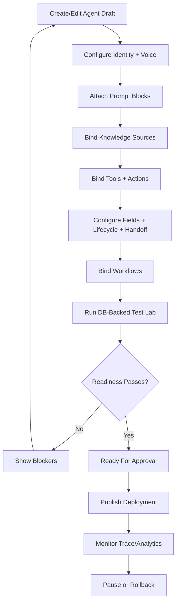

# Product-First Agent Builder

Date: 2026-06-06  
Status: Active product contract  
Canonical architecture: `Arquitectura-Deseada.md`

## Purpose

Agent Builder is the Product-First surface where a tenant configures, tests,
publishes, pauses, and rolls back AI agents. It is not a prompt editor. It is a
versioned control-plane UI/API over Agent, Agent Version, Deployment, Sources,
Actions, Fields, Workflows, Test Lab, Publish Control, and Trace.

Phase 3 now includes the first no-live Builder MVP slice. It implements a
Product-First Builder surface and API over the Phase 2 Product Entities
Foundation. It does not connect deployments to live runtime, WhatsApp, outbox,
workflow side effects, canary, or production traffic.

## Builder Tabs

| Tab | Purpose | Required Data | Publish Blockers |
|---|---|---|---|
| Identity | Name, role, goal, persona, owner | agent name, role, objective, channel scope | missing name/role/objective |
| Voice | Tone, style, language policy, examples | tone, max length, language policy, allowed/blocked phrasing | unsafe voice rules |
| Prompt Blocks | Structured instructions and constraints | identity, task, policy, examples, escalation blocks | contradictions or policy-breaking prompt |
| Knowledge Sources | Source bindings and source health | source_id, required flag, priority, status, retrieval preview | missing/unhealthy required source |
| Tools | Read/lookup capabilities | tool key, schema, required conditions | required tool unavailable |
| Actions | Side-effect capabilities | action binding, mode, approval, idempotency, risk | critical action lacks approval/dry-run |
| Fields | Contact memory read/write rules | visible fields, writable fields, evidence policy | critical field lacks policy |
| Lifecycle | Stage movement permissions | allowed stages, transitions, handoff stages | invalid transition map |
| Handoff | Human routing rules | trigger, reason, team/queue, SLA | missing fallback target |
| Workflows | Event bindings | event type, workflow target, side-effect mode | side effects enabled without approval |
| Test Lab | DB-backed scenario execution | suite, cases, assertions, traces | failing required test |
| Publish | Readiness, approval, rollback | readiness snapshot, approver, rollback version | unresolved blocker |
| Trace Preview | Why-answer inspection | latest test traces, tool/state/policy decisions | missing trace for required tests |

## Agent Builder Flow

## Required Builder Behaviors

- Builder edits drafts, not published versions.
- Publish creates or references an immutable Agent Version.
- Deployment Resolver uses only published deployment state.
- Every publish view shows source health, action readiness, tests, trace, and
  rollback target.
- Agent Builder never toggles live send directly. Publish Control and
  SendAdapter govern live behavior.
- Builder must show whether a capability is `not_started`, `implemented`,
  `connected`, `shadow`, `no_send_passed`, `single_contact_smoke`,
  `live_limited`, `production`, `blocked`, or `deprecated`.
- Builder must link to the trace for every Test Lab scenario.

## Permissions

| Permission | Allows |
|---|---|
| agent.read | View agent configuration |
| agent.draft.write | Edit draft agent/version |
| agent.sources.bind | Bind or unbind sources |
| agent.actions.bind | Bind or unbind actions |
| agent.tests.run | Run Test Lab scenarios |
| agent.publish.request | Request approval |
| agent.publish.approve | Approve publish |
| agent.pause | Pause deployment |
| agent.rollback | Roll back to approved version |

## Publish States

| State | Meaning | Send | Actions | Workflows |
|---|---|---|---|---|
| Draft | Editable configuration | off | dry-run only | off |
| Configured | Required config present | off | dry-run only | off |
| TestLab | DB-backed no-send testable | off | dry-run | stub/dry-run |
| ReadyForApproval | Required tests and readiness pass | off | dry-run or approved subset | dry-run |
| Published | Approved live deployment | SendAdapter policy | approved only | approved only |
| Paused | Deployment disabled | off | off | off |
| Rollback | Repoint to prior approved version | previous policy | previous policy | previous policy |

## Validation Rules

- Missing required source blocks publish.
- Missing required tool blocks publish.
- Critical action without approval policy blocks publish.
- Field write without evidence policy blocks publish.
- Workflow side effect without binding and mode blocks publish.
- Test Lab failure blocks publish.
- Missing rollback target blocks live publish.
- Missing trace for required test blocks publish.

## Agent Builder Must Not

- Write tenant-specific behavior into shared runtime.
- Treat smoke as architecture readiness.
- Treat fixture-only tests as publish readiness.
- Override `TurnOutput.final_message`.
- Enable live/send/outbox directly.
- Hide legacy interference.
- Publish with unresolved Feature Readiness blockers.

## Implemented MVP Slice - 2026-06-07

Implemented:

- Backend Builder endpoints under `/api/v1/product-agents`:
  - `GET /builder/options`
  - `GET /agents/{agent_id}/builder-state`
  - `POST /agents/{agent_id}/draft-version`
  - `PATCH /versions/{version_id}/builder-config`
  - `GET /versions/{version_id}/readiness`
- Frontend route `/agent-builder`.
- Tenant-scoped Product-First agent listing and creation.
- Draft version creation from Product Agent identity.
- Draft identity/instructions/prompt-block editing.
- Tools tab with fact-only capability options, draft tool bind/unbind, and
  no-side-effect metadata.
- Actions tab with side-effect capability options, disabled-by-default draft
  action bind/unbind, auth/permission/readiness metadata, and send boundary
  blockers.
- Readiness checks for identity, knowledge, tools, actions, fields,
  workflows, and deployment safety.
- Safety snapshot keeps send, outbox, live, actions, workflows, canary, and
  production off.

Not implemented in this slice:

- Test Lab execution UI.
- Publish request/approval UI.
- Deployment Resolver connection.
- SendAdapter connection.
- Runtime V2 behavior changes.
- Live traffic, smoke, WhatsApp, outbox, workflow side effects, or canary.

## Acceptance For Phase 3

Phase 3 is complete when:

- Agent Builder responsibilities are documented.
- Tabs, flows, permissions, publish states, blockers, and non-goals are defined.
- Builder references Product-First entities and readiness gates.
- MVP backend endpoints are tenant-scoped and use Product Entities only.
- MVP frontend uses `/api/v1/product-agents`, not legacy `/api/v1/agents`.
- Builder edits draft versions and published versions remain immutable.
- Readiness reports blockers without enabling live send or side effects.
- Tests cover the new or modified Builder behavior.
- No Runtime V2, Baileys, WhatsApp, outbox, live send, smoke, canary, action
  side effects, workflow side effects, or production traffic is touched.

## Implemented Tool/Action Binding Slice - 2026-06-07

Implemented:

- Backend Product-First capability registry distinguishes `tool` from
  `action`.
- Tools are fact/read-only capabilities:
  - `catalog.search`
  - `quote.resolve`
  - `requirements.lookup`
  - `document.check`
- Actions are side-effect capabilities:
  - `update_contact_field`
  - `trigger_workflow`
  - `call_webhook`
  - `send_message`
- Backend endpoints expose capability options and draft-scoped bind/unbind:
  - `GET /tools/options`
  - `GET /actions/options`
  - `GET|POST|DELETE /agents/{agent_id}/tool-bindings`
  - `GET|POST|DELETE /agents/{agent_id}/action-bindings`
- Agent Builder UI exposes separate Tools and Actions tabs.
- Action binding from the Builder defaults to `disabled`; enabling live action
  execution remains blocked.
- `send_message` is represented only as a blocked send boundary, not as an
  executable Builder action.

Not changed:

- Runtime V2 behavior.
- SendAdapter.
- WhatsApp/Baileys.
- Outbox.
- Workflow side effects.
- Live flags, smoke, canary, or production traffic.
