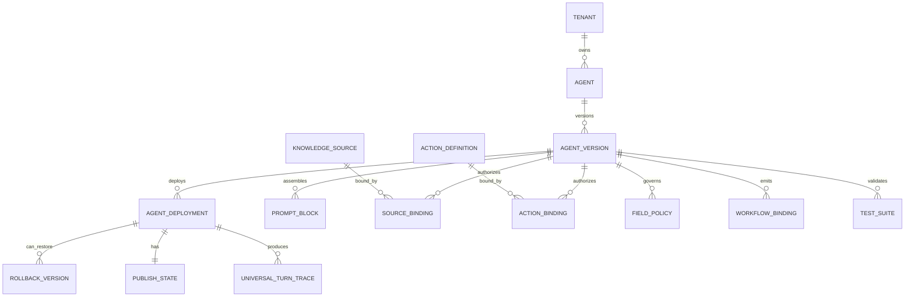

# Product-First Product Entities

Date: 2026-06-06  
Status: Active contract  
Canonical architecture: `Arquitectura-Deseada.md`

## Purpose

This document defines the Product-First control-plane entities and the runtime
ownership boundaries for AtendIA. The first implementation slice creates the
DB/model/API foundation only; it does not connect Runtime V2, WhatsApp,
outbox, workflow side effects, smoke, canary, or production traffic.

## Entity Ownership Rules

- Control-plane entities are tenant-scoped and versioned where publication or
  rollback matters.
- Runtime reads published control-plane snapshots; runtime does not invent
  tenant business policy.
- Draft configuration can change. Published agent versions are immutable.
- Runtime-plane state is turn/conversation/contact execution state, not product
  configuration.
- Reports are evidence. Product entity contracts live in `docs/architecture/`.

## Control-Plane Entities

| Entity | Owns | Key Fields | Relationships | Runtime Use |
|---|---|---|---|---|
| Tenant | Business/account boundary | tenant_id, name, status, config | owns all product entities | Runtime isolation and config scope |
| Agent | Product identity for an AI agent | agent_id, tenant_id, name, role, status | has many Agent Versions | Selected by deployment |
| Agent Version | Immutable agent configuration snapshot | version_id, agent_id, version, status, created_by, published_at | binds prompt blocks, sources, actions, fields, workflows, tests | Runtime executes only published versions |
| Agent Deployment | Channel/audience activation record | deployment_id, agent_version_id, channel, mode, audience_scope, state | points to one Agent Version | Deployment Resolver selects it |
| Prompt Block | Structured prompt component | block_id, type, content, priority, policy_tags | attached to Agent Version | Prompt assembly |
| Knowledge Source | Tenant factual source | source_id, type, status, health, freshness, language | has Source Bindings | Retrieval/tool grounding |
| Source Binding | Versioned source authorization | binding_id, version_id, source_id, required, priority, mode | links Agent Version to Knowledge Source | Controls allowed retrieval |
| Action Definition | Capability schema | action_id, key, input_schema, output_schema, risk_level, permissions | has Action Bindings | Defines executable action surface |
| Action Binding | Agent authorization for action | binding_id, version_id, action_id, mode, approval_policy | links Agent Version to Action Definition | Controls allowed actions |
| Field Policy | Read/write rules for contact fields | field_key, read_policy, write_policy, evidence_required, criticality | attached to Agent Version or tenant | StateWriter validation |
| Workflow Binding | Allowed workflow event bridge | binding_id, version_id, event_type, workflow_id, side_effect_mode | links Agent Version to workflow | Emits allowed events only |
| Test Suite | Publish readiness suite | suite_id, version_id, status, scenarios, assertions | belongs to Agent Version | Test Lab validation |
| Publish State | Deployment lifecycle state | state, approver, reason, readiness_snapshot | belongs to Deployment | Blocks or allows live |
| Rollback Version | Previous approved target | rollback_id, deployment_id, target_version_id, reason | belongs to Deployment | Immediate rollback |
| Feature Readiness | Capability status registry | feature_key, state, evidence, blockers, next_gate | tenant/global scoped | Publish blockers |
| ADR | Architecture decision | adr_id, status, decision, consequences | applies to specs/contracts | Governance |

## Runtime-Plane Entities

| Entity | Owns | Key Fields | Control-Plane Inputs |
|---|---|---|---|
| Channel Event | Normalized inbound | channel, message_id, attachments, sender | Deployment by channel/audience |
| Inbox Event | Persisted conversation event | conversation_id, contact_id, text, media | Tenant and deployment scope |
| Turn Context | Snapshot for one turn | recent messages, contact attrs, lifecycle, memory, sources | Agent Version, bindings, field policies |
| Semantic Interpretation | ChatGPT structured understanding | intent, proposed work, missing slots, required tools | Prompt blocks and context |
| Tool Result | Validated fact or lookup | tool_name, status, structured data, citations | Source/action bindings |
| State Write Decision | Accepted/blocked state changes | field updates, lifecycle, blocked reasons | Field Policy |
| Turn Output | Final runtime result | final_message, actions, field_updates, trace | Policy and Composer |
| Send Decision | Delivery gate | no_send, live_candidate, enqueue, blocked_reason | Publish State and SendAdapter |
| Universal Turn Trace | Audit | context, tools, state, policy, output, send | All control-plane references |

## Relationships

## Runtime Ownership Boundaries

### AgentService Owns

- resolving the active deployment
- building TurnContext
- invoking ChatGPT/Semantic Provider
- executing tenant-aware tools
- applying StateWriter decisions
- applying Policy
- producing `TurnOutput.final_message`
- passing approved output to SendAdapter
- attaching Universal Turn Trace

### ChatGPT Owns

- conversational interpretation
- ambiguity detection
- natural wording proposals
- structured tool/action proposals
- final natural-language drafting when Composer is LLM-backed

### AtendIA Owns

- tenant scoping
- facts and tool validation
- state writes
- action authorization
- workflow event authorization
- handoff routing
- policy
- send/no-send decision
- trace
- publish and rollback

### Workflows Own

- downstream automations after authorized events
- internal notifications/tasks
- non-primary process state

Workflows do not own primary customer-visible copy.

## State Rules

- Draft Agent Versions may be edited.
- Published Agent Versions are immutable.
- A Deployment points to exactly one active Agent Version per channel/audience
  scope.
- Rollback changes the Deployment pointer to a prior approved Agent Version.
- A required Source Binding or Action Binding blocker prevents publish.
- Test Suite pass is required before Ready for Approval.
- Live is not a separate brain; it is the same runtime with SendAdapter allowed.

## Acceptance For Phase 2

Phase 2 is complete when:

- Control-plane entities are documented and implemented as tenant-scoped
  Product-First tables/models.
- Runtime-plane responsibilities are documented and remain disconnected from
  this foundation until a later approved runtime integration phase.
- Ownership boundaries are explicit.
- Published Agent Versions are immutable.
- Agent Deployments have publish state and rollback target references, but
  cannot enable live send, outbox, smoke, canary, actions, workflow events, or
  production traffic in this phase.
- Knowledge Source, Tool, Action, Field, Workflow, Test Suite, and Test Scenario
  bindings exist as Product-First control-plane foundation.
- Tests prove tenant scoping, immutable published versions, publish state safety,
  binding validation, no live send activation, and no tenant/vertical hardcode.
- Later runtime implementation can read these entities through an approved
  adapter without inventing ownership or bypassing publish gates.

## Implementation Slice - Product Entities Foundation

Date: 2026-06-07

Implemented scope:

- `agent_versions`
- `agent_deployments`
- `agent_knowledge_source_bindings`
- `agent_tool_bindings`
- `agent_action_bindings`
- `agent_field_permissions`
- `agent_workflow_bindings`
- `agent_test_suites`
- `agent_test_scenarios`
- `agent_publish_events`

Out of scope for this slice:

- Runtime V2 dependency on these entities
- WhatsApp/Baileys activation
- SendAdapter changes
- outbox writes
- workflow side effects
- live, smoke, canary, or open production
- legacy deletion
- tenant-specific business rules in shared runtime code
