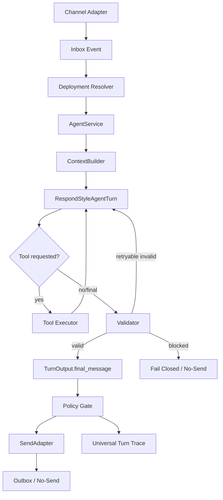

# Product-First Runtime Single Route

Date: 2026-06-06  
Status: Active architecture contract  
Canonical source: `Arquitectura-Deseada.md`

## Purpose

AtendIA must converge on one DB-backed AgentService route for customer turns.
No-send, live-candidate, and live must exercise the same context, same tools,
same StateWriter, same policy, same RespondStyleAgentTurn, and same
`TurnOutput.final_message`. The only allowed difference between no-send and a
send-capable mode is SendAdapter behavior.

This document defines the target route and legacy boundary. It is
documentation-only for this phase. It does not activate runtime, DB, Docker,
WhatsApp, outbox, actions, workflows, smoke, or live flags.

## Non-Negotiable Runtime Invariant

`TurnOutput.final_message` is the only customer-facing response authority.

No workflow, legacy runner, fallback, recovery branch, adapter, tool, action, or
debug path may overwrite or send different visible customer copy for a published
Runtime V2 deployment.

## Target Route

## Respond-Style Turn Update - 2026-06-09

Published Product Agent turns must not use `StructuredRuntimeComposer`,
`HumanResponseComposer`, or `ValidatedResponsePlanBuilder` as customer-facing
scriptwriters.

The target path is:

- `RespondStyleAgentTurn` or `LLMAgentTurn`: asks the LLM to produce a customer
  response and structured proposals from agent config, state, tools, KB, and
  policies.
- Tool loop: if the LLM requests a permitted tool, AtendIA executes it and
  returns structured results to the next LLM turn.
- Validator: checks facts, required tools, field writes, actions, workflow
  events, handoff, policy, and sendability.
- Retry with feedback: invalid retryable output returns structured validator
  feedback to the LLM. It never triggers visible fallback copy.
- Fail closed: non-retryable or repeated invalid output produces no-send, trace,
  and blocker metadata.

AgentService owns the turn from normalized inbound event through final send
decision. Other systems provide structured inputs or consume normalized events;
they do not create parallel visible response paths.

## AgentTurnRequest Contract

The target request to AgentService must be sufficient to reproduce the same
turn in Test Lab, no-send, live-candidate, and live.

Minimum target fields:

- `tenant_id`
- `deployment_id`
- `agent_id`
- `agent_version_id`
- `runtime_mode`
- `send_mode`
- `channel`
- `conversation_id`
- `contact_id`
- `contact_snapshot`
- `conversation_snapshot`
- `last_messages`
- `last_bot_question`
- `pending_slot`
- `inbound_message`
- `attachments`
- `knowledge_scope`
- `source_bindings`
- `allowed_tools`
- `allowed_actions`
- `field_policies`
- `workflow_bindings`
- `policy_context`
- `trace_context`

The request cannot depend on hidden process state that Test Lab cannot recreate.

## AgentTurnResult Contract

The target result from AgentService must make every decision auditable.

Minimum target fields:

- `turn_id`
- `trace_id`
- `intent`
- `semantic_interpretation`
- `required_tools`
- `tool_results`
- `state_write_decisions`
- `lifecycle_decisions`
- `handoff_decision`
- `action_decisions`
- `workflow_events`
- `validator_feedback`
- `policy_decision`
- `send_decision`
- `final_message`
- `blocked_reason`
- `rollback_hint`

`final_message` may be null when policy or send gating blocks visible output.
Internal messages, debug text, traces, and recovery text must not fill this
field.

## Runtime Modes

Allowed target modes:

- `test_lab_no_send`: DB-backed Test Lab, SendAdapter disabled.
- `readiness_no_send`: readiness replay, SendAdapter disabled.
- `live_candidate`: same route as live, send decision calculated, SendAdapter
  can stage only when explicitly allowed.
- `live_limited`: approved scoped live traffic through SendAdapter.
- `paused`: deployment resolved but no customer send allowed.

Mode changes must be deployment state changes, not scattered flag-only behavior.

## SendAdapter Boundary

SendAdapter is the only component that can transform an approved
`TurnOutput.final_message` into an outbound channel operation.

SendAdapter must receive:

- approved `final_message`
- send decision
- tenant id
- conversation id
- contact id
- channel
- deployment id
- trace id
- idempotency key

SendAdapter must not:

- compose customer copy
- repair customer copy
- substitute fallback text
- call tools to invent missing facts
- bypass policy
- send for contacts outside scope

## Fail-Closed Rules

The route must fail closed when:

- required tool is missing, skipped, failed, or blocked
- required Knowledge Source is unhealthy or unbound
- StateWriter attempted an unsupported hard-field write
- policy blocks a claim or output
- live send scope is not approved
- legacy fallback would become visible
- workflow attempts to replace customer copy
- provider fallback produces generic visible text

Fail-closed means no visible send, trace written, blocker surfaced, and rollback
or handoff path recorded as applicable.

## Legacy Boundary

Legacy is not deleted in this phase. For Product-First published deployments:

- legacy runner is `BLOCK_FOR_V2` as a visible route
- published Product Agent entrypoint cannot be `ConversationRunner`
- old advisor brain cannot produce final visible copy
- response contract fallbacks cannot send customer text
- ConversationProgressGuard cannot replace `TurnOutput.final_message`
- StructuredRuntimeComposer cannot produce published Product Agent copy
- HumanResponseComposer cannot produce published Product Agent copy
- ValidatedResponsePlanBuilder cannot turn slots into visible questions
- workflow copy paths cannot send customer text outside SendAdapter
- smoke-only logic cannot be publish readiness
- fixture-only preflight cannot prove live readiness

Legacy may remain for non-migrated tenants, migration adapters, or internal
comparison only when it cannot affect published Runtime V2 customer copy.

## Ownership Boundaries

ChatGPT / Semantic Provider:

- interprets customer language and ambiguity
- proposes structured intent, missing fields, and draft copy
- does not validate tenant hard facts by itself

Tools:

- resolve structured facts from tenant-aware contracts and sources
- return structured data, not final visible copy

StateWriter:

- writes only validated fields with evidence and policy permission
- blocks ambiguous or unsupported writes

RespondStyleAgentTurn:

- asks the LLM to draft `final_message` and structured proposals from validated
  context
- requests tools when facts are required
- incorporates tool results before final answer
- accepts validator feedback for retry
- does not bypass AtendIA validation

Policy Gate:

- blocks unsupported claims, unsafe sends, generic recovery copy, and side
  effects without approval

SendAdapter:

- sends only approved final output within approved scope

Trace:

- records every decision, blocker, tool, state write, policy result, and send
  decision

## Future Tests

Future implementation for this contract must include unit or integration tests
for new or modified behavior, with 100% coverage of that behavior:

- no-send and live-candidate produce same context, tools, StateWriter, policy,
  and final message
- SendAdapter is the only difference between no-send and send-capable mode
- Product-First published deployment does not call ConversationRunner
- RespondStyleAgentTurn retry uses validator feedback, not fallback copy
- tool result returns to LLM context before final_message for tool-required
  facts
- required tool skipped means no-send
- policy failure means no-send
- legacy cannot override published Runtime V2 visible output
- workflow cannot overwrite `TurnOutput.final_message`
- provider fallback text never becomes customer-visible copy
- internal/debug/recovery text never becomes customer-visible copy
- trace includes request, interpretation, tools, state, policy, send decision,
  and final message or blocked reason

Codex code review against base branch or uncommitted changes is required before
implementation handoff.

## Phase 5 Acceptance

Fase 5 is complete when:

- AgentService single-route ownership is documented
- AgentTurnRequest and AgentTurnResult contracts are documented
- mode and SendAdapter boundaries are documented
- fail-closed rules are documented
- legacy visible-output boundary is documented
- future tests are documented
- no live/runtime/DB behavior was changed

Decision for this documentary phase:

`PRODUCT_FIRST_PHASE_5_RUNTIME_SINGLE_ROUTE_DEFINED_DOCS_ONLY`
